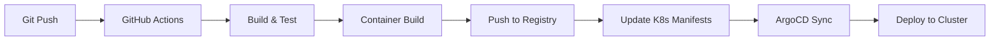

# 負荷テストシミュレーション アーキテクチャ設計

## システム概要

Kubernetesクラスター上で動作する負荷テストシミュレーションWebアプリケーション。ユーザーのインタラクションによる負荷生成、リアルタイムのPod数監視、ゲーミフィケーション要素を組み合わせた教育・デモンストレーションツール。

## アーキテクチャパターン

- **パターン**: マイクロサービスアーキテクチャ with Event-Driven Communication
- **理由**: 
  - スケーラビリティ: 各コンポーネントを独立してスケーリング可能
  - リアルタイム性: WebSocket/SSEによるイベント駆動型の通信
  - Kubernetes親和性: コンテナベースのマイクロサービスとKubernetesの相性が良い
  - 障害分離: 一部のサービス障害が全体に波及しない

## コンポーネント構成

### フロントエンド

- **フレームワーク**: React 18+ with TypeScript
- **状態管理**: Zustand (軽量で学習コストが低い)
- **リアルタイム通信**: Socket.io-client (WebSocket with fallback)
- **UIフレームワーク**: Tailwind CSS + Framer Motion (アニメーション)
- **ビルドツール**: Vite (高速なHMRとビルド)

### バックエンド

#### API Gateway
- **フレームワーク**: Node.js + Express
- **認証方式**: JWT (オプション機能用)
- **レート制限**: express-rate-limit
- **CORS**: cors middleware

#### Load Generator Service
- **言語**: Go (高パフォーマンス)
- **負荷生成**: Goroutines for concurrent processing
- **メトリクス**: Prometheus client

#### Metrics Collector Service
- **言語**: Go
- **Kubernetes Client**: client-go library
- **データ収集**: Watch API for real-time Pod monitoring

#### WebSocket Service
- **フレームワーク**: Node.js + Socket.io
- **スケーリング**: Redis Adapter for horizontal scaling
- **イベント配信**: Pub/Sub pattern

### データストレージ

#### セッションストア
- **データベース**: Redis
- **用途**: 
  - WebSocketセッション管理
  - ゲーム状態の一時保存
  - レート制限カウンター

#### メトリクスストア (オプション)
- **データベース**: PostgreSQL with TimescaleDB
- **用途**: 
  - 履歴データの永続化
  - スコアボード機能
  - 分析用データ

#### キャッシュ
- **技術**: Redis
- **戦略**: 
  - Pod数のキャッシュ (TTL: 1秒)
  - Kubernetes API応答のキャッシュ

## インフラストラクチャ

### Kubernetes リソース

```yaml
Deployments:
  - frontend (Replicas: 2-10)
  - api-gateway (Replicas: 2-5)
  - load-generator (Replicas: 1-20) # HPA/KEDA target
  - metrics-collector (Replicas: 1)
  - websocket-service (Replicas: 2-5)

Services:
  - frontend-service (LoadBalancer/NodePort)
  - api-gateway-service (ClusterIP)
  - load-generator-service (ClusterIP)
  - metrics-collector-service (ClusterIP)
  - websocket-service (ClusterIP)
  - redis-service (ClusterIP)

ConfigMaps:
  - app-config (環境設定)
  - game-config (ゲームパラメータ)

Secrets:
  - k8s-api-credentials
  - redis-credentials

HPA/KEDA:
  - load-generator-hpa (CPU/Memory based)
  - custom-metrics-scaler (Request rate based)
```

### ネットワーキング

- **Ingress Controller**: NGINX Ingress
- **パスルーティング**:
  - `/` → Frontend Service
  - `/api/*` → API Gateway Service
  - `/ws` → WebSocket Service (Sticky Session)

## セキュリティ設計

### ネットワークセキュリティ
- NetworkPolicies for pod-to-pod communication
- TLS termination at Ingress level
- Service Mesh (Istio) for mTLS (オプション)

### アプリケーションセキュリティ
- RBAC for Kubernetes API access
- Rate limiting per IP/Session
- Input validation and sanitization
- CSP headers for XSS protection
- CSRF tokens for state-changing operations

### シークレット管理
- Kubernetes Secrets with encryption at rest
- External Secrets Operator for cloud provider integration (オプション)
- Least privilege principle for service accounts

## スケーラビリティ設計

### 水平スケーリング
- **Frontend**: CDN配信 + 複数レプリカ
- **API Gateway**: ロードバランサー経由で分散
- **Load Generator**: HPA/KEDAによる自動スケーリング
- **WebSocket**: Sticky Sessionによる接続維持

### 垂直スケーリング
- Resource requests/limits の適切な設定
- JVMヒープサイズの最適化 (該当する場合)
- Database connection pooling

## 監視・可観測性

### メトリクス
- **Prometheus**: システムメトリクス収集
- **Custom Metrics**: 
  - リクエスト数/秒
  - アクティブユーザー数
  - ゲーム完了率

### ロギング
- **Fluentd/Fluent Bit**: ログ収集
- **Elasticsearch**: ログストレージ
- **構造化ログ**: JSON形式

### トレーシング (オプション)
- **Jaeger/Zipkin**: 分散トレーシング
- **OpenTelemetry**: 標準化された計装

## デプロイメント戦略

### CI/CD Pipeline


### デプロイメント方式
- **Blue-Green Deployment**: フロントエンド
- **Rolling Update**: バックエンドサービス
- **Canary Deployment**: 新機能のA/Bテスト用

## 障害対策

### 高可用性
- Multi-AZ deployment
- Pod Anti-Affinity rules
- Readiness/Liveness probes
- Circuit breaker pattern

### 障害復旧
- Automatic pod restart
- Persistent volume snapshots
- Database backup strategy
- Graceful degradation (デモモード)

## パフォーマンス最適化

### フロントエンド
- Code splitting and lazy loading
- Image optimization (WebP format)
- Service Worker for offline capability
- Browser caching strategy

### バックエンド
- Connection pooling
- Query optimization
- Caching strategy (Redis)
- Batch processing for metrics

### ネットワーク
- HTTP/2 support
- gzip compression
- WebSocket connection reuse
- CDN for static assets

## 開発環境

### ローカル開発
- Docker Compose for local stack
- Minikube/Kind for K8s testing
- Hot reload for all services
- Mock Kubernetes API for testing

### ツールチェイン
- **言語**: TypeScript, Go
- **パッケージ管理**: npm/yarn, Go modules
- **コード品質**: ESLint, Prettier, golangci-lint
- **テスト**: Jest, Go testing, k6 for load testing