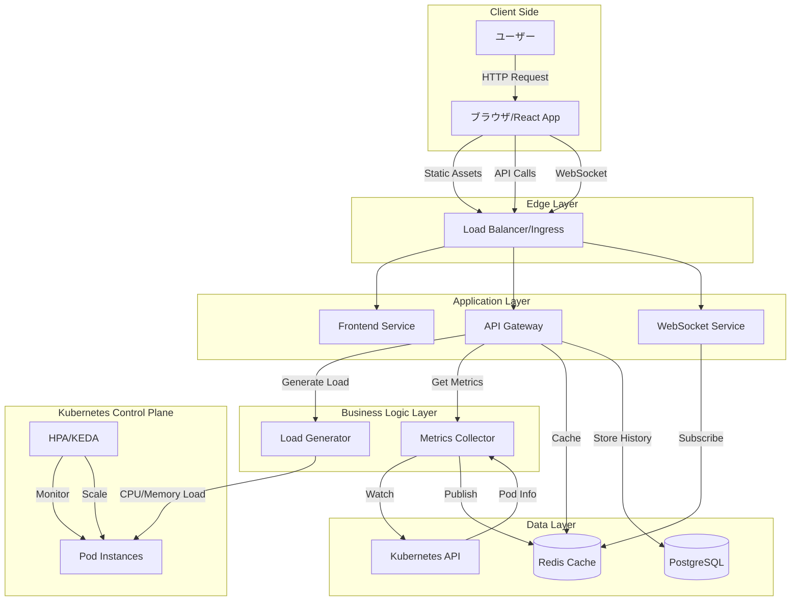
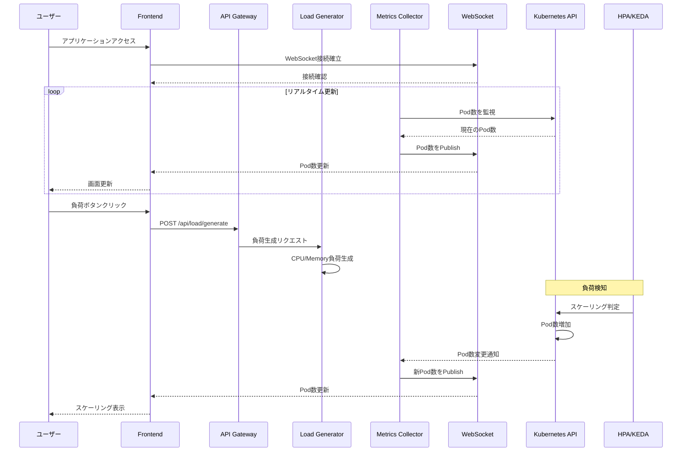
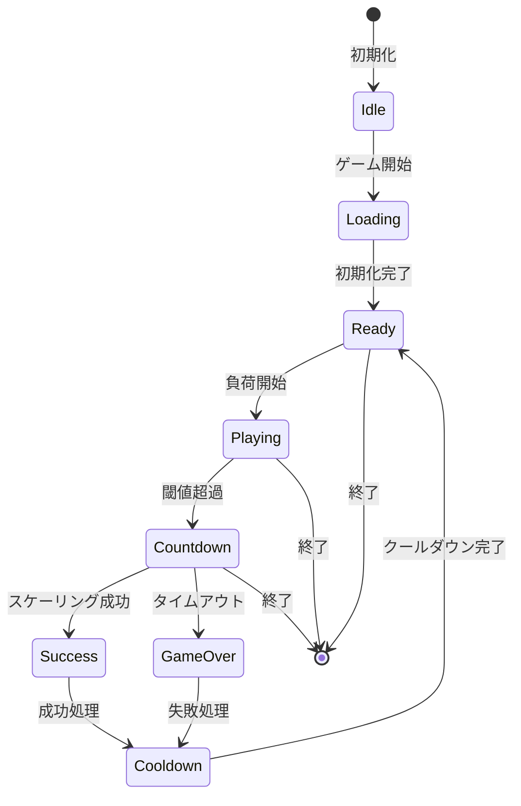
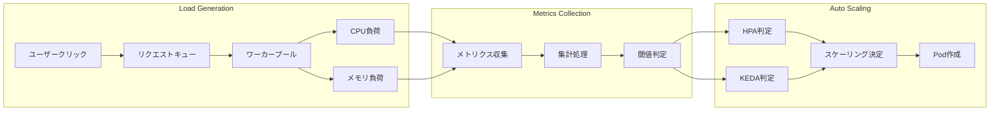
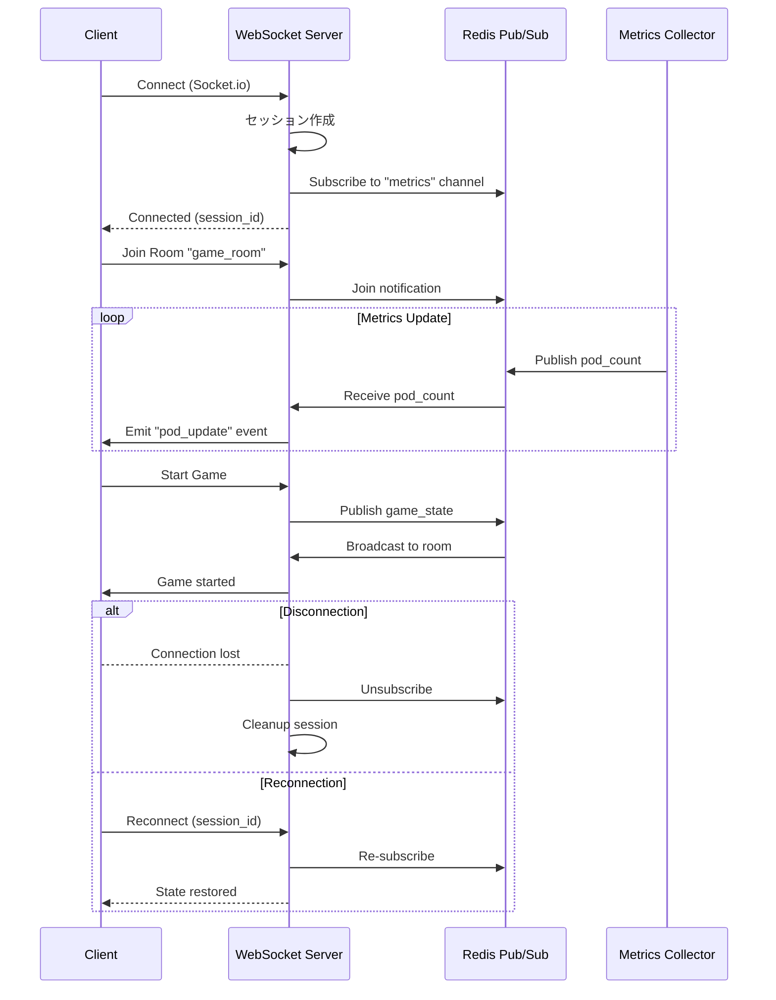
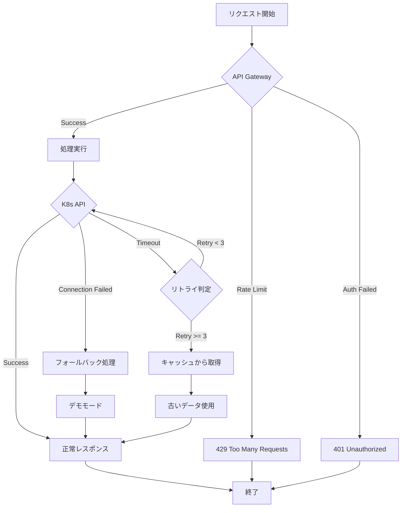
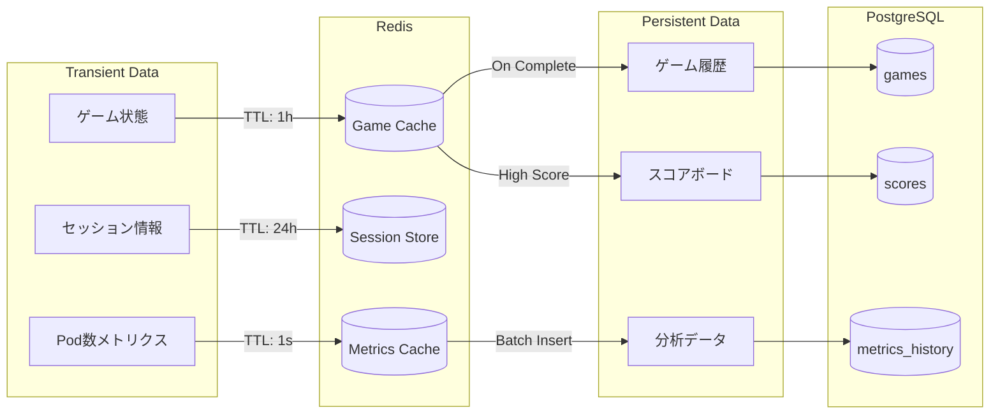
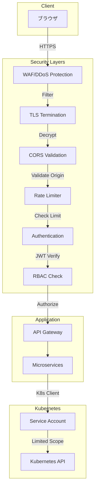
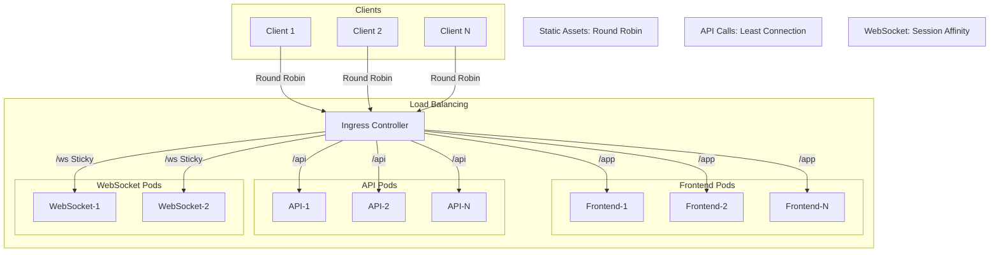

# データフロー図

## システム全体のデータフロー

```mermaid
flowchart TB
    subgraph "Client Side"
        U[ユーザー]
        B[ブラウザ/React App]
    end
    
    subgraph "Edge Layer"
        LB[Load Balancer/Ingress]
    end
    
    subgraph "Application Layer"
        FE[Frontend Service]
        API[API Gateway]
        WS[WebSocket Service]
    end
    
    subgraph "Business Logic Layer"
        LG[Load Generator]
        MC[Metrics Collector]
    end
    
    subgraph "Data Layer"
        Redis[(Redis Cache)]
        K8s[Kubernetes API]
        PG[(PostgreSQL)]
    end
    
    subgraph "Kubernetes Control Plane"
        HPA[HPA/KEDA]
        Pods[Pod Instances]
    end
    
    U -->|HTTP Request| B
    B -->|Static Assets| LB
    LB --> FE
    B -->|API Calls| LB
    LB --> API
    B -->|WebSocket| LB
    LB --> WS
    
    API -->|Generate Load| LG
    API -->|Get Metrics| MC
    API -->|Cache| Redis
    API -->|Store History| PG
    
    WS -->|Subscribe| Redis
    MC -->|Watch| K8s
    MC -->|Publish| Redis
    
    LG -->|CPU/Memory Load| Pods
    HPA -->|Monitor| Pods
    HPA -->|Scale| Pods
    K8s -->|Pod Info| MC
```

## ユーザーインタラクションフロー

```mermaid
sequenceDiagram
    participant U as ユーザー
    participant F as Frontend
    participant A as API Gateway
    participant L as Load Generator
    participant M as Metrics Collector
    participant W as WebSocket
    participant K as Kubernetes API
    participant H as HPA/KEDA
    
    U->>F: アプリケーションアクセス
    F->>W: WebSocket接続確立
    W-->>F: 接続確認
    
    loop リアルタイム更新
        M->>K: Pod数を監視
        K-->>M: 現在のPod数
        M->>W: Pod数をPublish
        W-->>F: Pod数更新
        F-->>U: 画面更新
    end
    
    U->>F: 負荷ボタンクリック
    F->>A: POST /api/load/generate
    A->>L: 負荷生成リクエスト
    L->>L: CPU/Memory負荷生成
    
    Note over H,K: 負荷検知
    H->>K: スケーリング判定
    K->>K: Pod数増加
    
    K-->>M: Pod数変更通知
    M->>W: 新Pod数をPublish
    W-->>F: Pod数更新
    F-->>U: スケーリング表示
```

## ゲーム状態管理フロー

```mermaid
stateDiagram-v2
    [*] --> Idle: 初期化
    
    Idle --> Loading: ゲーム開始
    Loading --> Ready: 初期化完了
    
    Ready --> Playing: 負荷開始
    Playing --> Countdown: 閾値超過
    
    Countdown --> Success: スケーリング成功
    Countdown --> GameOver: タイムアウト
    
    Success --> Cooldown: 成功処理
    GameOver --> Cooldown: 失敗処理
    
    Cooldown --> Ready: クールダウン完了
    
    Ready --> [*]: 終了
    Playing --> [*]: 終了
    Countdown --> [*]: 終了
```

## 負荷生成とスケーリングフロー

```mermaid
flowchart LR
    subgraph "Load Generation"
        Click[ユーザークリック]
        Queue[リクエストキュー]
        Worker[ワーカープール]
        CPU[CPU負荷]
        Memory[メモリ負荷]
    end
    
    subgraph "Metrics Collection"
        Metrics[メトリクス収集]
        Aggregation[集計処理]
        Threshold[閾値判定]
    end
    
    subgraph "Auto Scaling"
        HPA_Check[HPA判定]
        KEDA_Check[KEDA判定]
        Scale_Decision[スケーリング決定]
        Pod_Creation[Pod作成]
    end
    
    Click --> Queue
    Queue --> Worker
    Worker --> CPU
    Worker --> Memory
    
    CPU --> Metrics
    Memory --> Metrics
    Metrics --> Aggregation
    Aggregation --> Threshold
    
    Threshold --> HPA_Check
    Threshold --> KEDA_Check
    HPA_Check --> Scale_Decision
    KEDA_Check --> Scale_Decision
    Scale_Decision --> Pod_Creation
```

## WebSocket通信フロー

```mermaid
sequenceDiagram
    participant C as Client
    participant WS as WebSocket Server
    participant R as Redis Pub/Sub
    participant MC as Metrics Collector
    
    C->>WS: Connect (Socket.io)
    WS->>WS: セッション作成
    WS->>R: Subscribe to "metrics" channel
    WS-->>C: Connected (session_id)
    
    C->>WS: Join Room "game_room"
    WS->>R: Join notification
    
    loop Metrics Update
        MC->>R: Publish pod_count
        R->>WS: Receive pod_count
        WS->>C: Emit "pod_update" event
    end
    
    C->>WS: Start Game
    WS->>R: Publish game_state
    R->>WS: Broadcast to room
    WS->>C: Game started
    
    alt Disconnection
        C-->WS: Connection lost
        WS->>R: Unsubscribe
        WS->>WS: Cleanup session
    else Reconnection
        C->>WS: Reconnect (session_id)
        WS->>R: Re-subscribe
        WS-->>C: State restored
    end
```

## エラーハンドリングフロー

```mermaid
flowchart TD
    Start[リクエスト開始]
    
    Start --> API_Check{API Gateway}
    API_Check -->|Success| Process[処理実行]
    API_Check -->|Rate Limit| Error_429[429 Too Many Requests]
    API_Check -->|Auth Failed| Error_401[401 Unauthorized]
    
    Process --> K8s_Check{K8s API}
    K8s_Check -->|Success| Response[正常レスポンス]
    K8s_Check -->|Connection Failed| Fallback[フォールバック処理]
    K8s_Check -->|Timeout| Retry{リトライ判定}
    
    Retry -->|Retry < 3| K8s_Check
    Retry -->|Retry >= 3| Cache[キャッシュから取得]
    
    Fallback --> Demo_Mode[デモモード]
    Cache --> Stale_Data[古いデータ使用]
    
    Demo_Mode --> Response
    Stale_Data --> Response
    
    Response --> End[終了]
    Error_429 --> End
    Error_401 --> End
```

## データ永続化フロー

```mermaid
flowchart LR
    subgraph "Transient Data"
        GameState[ゲーム状態]
        SessionData[セッション情報]
        PodMetrics[Pod数メトリクス]
    end
    
    subgraph "Redis"
        GameCache[(Game Cache)]
        SessionStore[(Session Store)]
        MetricsCache[(Metrics Cache)]
    end
    
    subgraph "Persistent Data"
        GameHistory[ゲーム履歴]
        UserScores[スコアボード]
        Analytics[分析データ]
    end
    
    subgraph "PostgreSQL"
        GameTable[(games)]
        ScoreTable[(scores)]
        MetricsTable[(metrics_history)]
    end
    
    GameState -->|TTL: 1h| GameCache
    SessionData -->|TTL: 24h| SessionStore
    PodMetrics -->|TTL: 1s| MetricsCache
    
    GameCache -->|On Complete| GameHistory
    GameHistory --> GameTable
    
    GameCache -->|High Score| UserScores
    UserScores --> ScoreTable
    
    MetricsCache -->|Batch Insert| Analytics
    Analytics --> MetricsTable
```

## セキュリティフロー

```mermaid
flowchart TD
    subgraph "Client"
        Browser[ブラウザ]
    end
    
    subgraph "Security Layers"
        WAF[WAF/DDoS Protection]
        TLS[TLS Termination]
        CORS[CORS Validation]
        RateLimit[Rate Limiter]
        Auth[Authentication]
        RBAC[RBAC Check]
    end
    
    subgraph "Application"
        API[API Gateway]
        Services[Microservices]
    end
    
    subgraph "Kubernetes"
        SA[Service Account]
        K8sAPI[Kubernetes API]
    end
    
    Browser -->|HTTPS| WAF
    WAF -->|Filter| TLS
    TLS -->|Decrypt| CORS
    CORS -->|Validate Origin| RateLimit
    RateLimit -->|Check Limit| Auth
    Auth -->|JWT Verify| RBAC
    RBAC -->|Authorize| API
    
    API --> Services
    Services -->|K8s Client| SA
    SA -->|Limited Scope| K8sAPI
```

## 負荷分散フロー

```mermaid
flowchart TB
    subgraph "Clients"
        C1[Client 1]
        C2[Client 2]
        C3[Client N]
    end
    
    subgraph "Load Balancing"
        Ingress[Ingress Controller]
        
        subgraph "Frontend Pods"
            FE1[Frontend-1]
            FE2[Frontend-2]
            FE3[Frontend-N]
        end
        
        subgraph "API Pods"
            API1[API-1]
            API2[API-2]
            API3[API-N]
        end
        
        subgraph "WebSocket Pods"
            WS1[WebSocket-1]
            WS2[WebSocket-2]
        end
    end
    
    C1 & C2 & C3 -->|Round Robin| Ingress
    
    Ingress -->|/app| FE1 & FE2 & FE3
    Ingress -->|/api| API1 & API2 & API3
    Ingress -->|/ws Sticky| WS1 & WS2
    
    Note1[Static Assets: Round Robin]
    Note2[API Calls: Least Connection]
    Note3[WebSocket: Session Affinity]
```