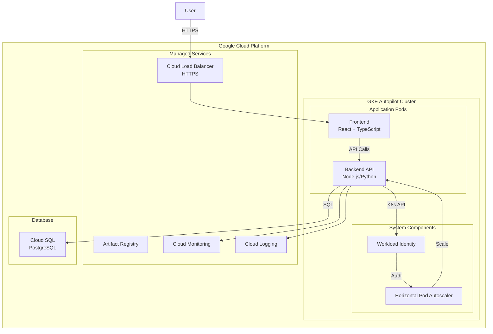

# シンプル負荷テストシミュレーション アーキテクチャ設計

## システム概要

GKE上で動作する負荷テストデモアプリケーション。ユーザーがWeb UIから負荷を生成し、Kubernetes HPAによる自動スケーリングをリアルタイムで観察できるシステム。

## アーキテクチャパターン

- **パターン**: モノリシック + API分離
- **理由**: 
  - シンプルな要件に対して過度な複雑性を避ける
  - 開発・デプロイの容易性を優先
  - 学習目的に適した構成

## システム構成図



## コンポーネント構成

### フロントエンド
- **フレームワーク**: React 18+ with TypeScript
- **ビルドツール**: Vite
- **状態管理**: React Hooks (useState, useEffect)
- **HTTPクライアント**: Fetch API
- **スタイリング**: CSS Modules
- **ポーリング**: 5秒間隔でメトリクス取得

### バックエンド
- **フレームワーク**: 
  - Option A: Node.js + Express + TypeScript
  - Option B: Python + FastAPI
- **認証方式**: なし（デモアプリのため）
- **Kubernetes連携**: 公式クライアントライブラリ使用
- **エラーハンドリング**: 統一エラーレスポンス形式
- **ヘルスチェック**: /health エンドポイント

### データベース
- **DBMS**: Cloud SQL for PostgreSQL 14+
- **接続方式**: Cloud SQL Proxy経由
- **コネクションプール**: 最大10接続
- **スキーマ管理**: マイグレーションスクリプト
- **バックアップ**: 自動バックアップ（1日1回）

### インフラストラクチャ
- **GKE設定**:
  - Autopilotモード（自動スケーリング・管理）
  - VPCネイティブネットワーキング
  - Workload Identity有効化
- **ネットワーク**:
  - Cloud Load Balancer（L7）
  - SSL/TLS終端
  - 静的IPアドレス
- **セキュリティ**:
  - Workload Identityによる認証
  - 最小権限の原則
  - ネットワークポリシー適用

## デプロイメント戦略

### コンテナイメージ
- **レジストリ**: Artifact Registry
- **タグ戦略**: git commit SHA使用
- **マルチステージビルド**: 最小イメージサイズ

### Kubernetesリソース
```yaml
# 主要リソース
- Deployment (frontend)
- Deployment (backend)  
- Service (ClusterIP)
- Ingress (Google Cloud Load Balancer)
- HorizontalPodAutoscaler
- ServiceAccount (Workload Identity)
- ConfigMap (設定)
- Secret (DB接続情報)
```

### スケーリング設定
- **HPA設定**:
  - 最小Pod数: 1
  - 最大Pod数: 10
  - CPU使用率閾値: 50%
  - スケールアップ: 15秒
  - スケールダウン: 5分

## 非機能要件への対応

### パフォーマンス
- フロントエンドの静的アセットCDN配信
- バックエンドAPIレスポンスキャッシュ（1秒）
- データベースコネクションプーリング

### セキュリティ
- HTTPS通信の強制
- CORS設定（特定オリジンのみ許可）
- Workload Identityによる認証
- セキュリティヘッダーの設定

### 可用性
- GKE Autopilotによる自動復旧
- ヘルスチェックによる異常Pod除外
- Cloud SQLの高可用性構成（オプション）

### 監視・ログ
- Cloud Monitoringでメトリクス収集
- Cloud Loggingで構造化ログ
- エラー率のアラート設定

## 技術選定の根拠

### GKE Autopilot選択理由
1. 運用負荷の最小化
2. 自動的なセキュリティパッチ適用
3. コスト最適化（使用分のみ課金）
4. 学習目的に適した抽象化レベル

### TypeScript/Python選択理由
1. 型安全性によるバグ削減
2. 優れたKubernetesクライアントライブラリ
3. 活発なコミュニティサポート
4. 学習リソースの豊富さ

### PostgreSQL選択理由
1. ACID特性による信頼性
2. JSON型を使わない正規化設計に適合
3. Cloud SQLによる管理の容易さ
4. 拡張性と性能のバランス