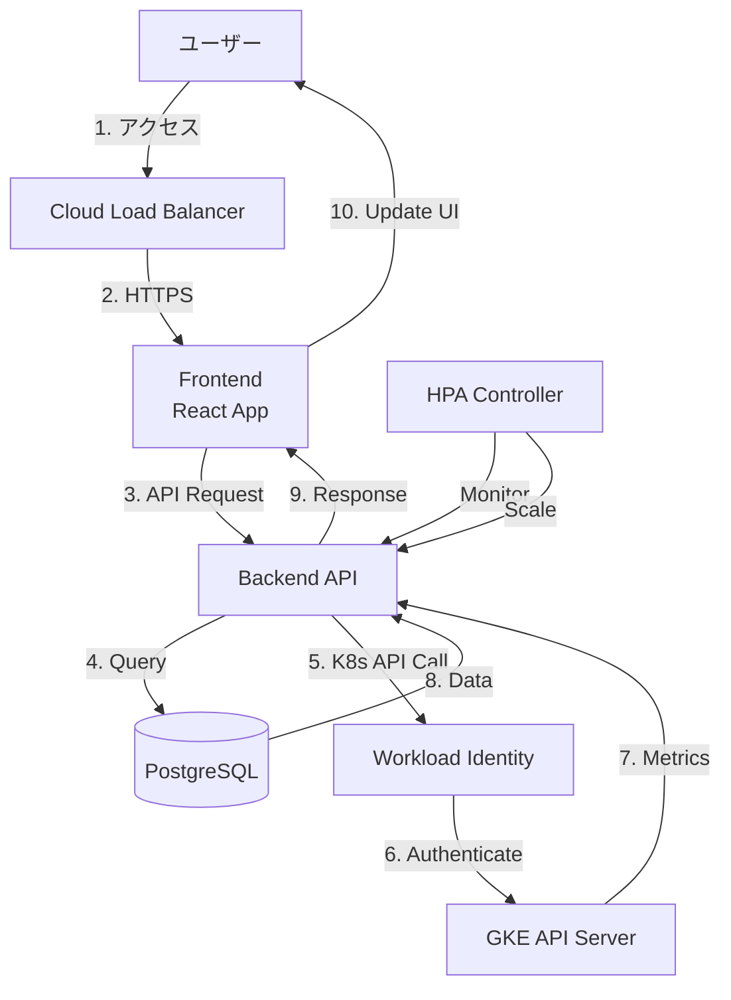
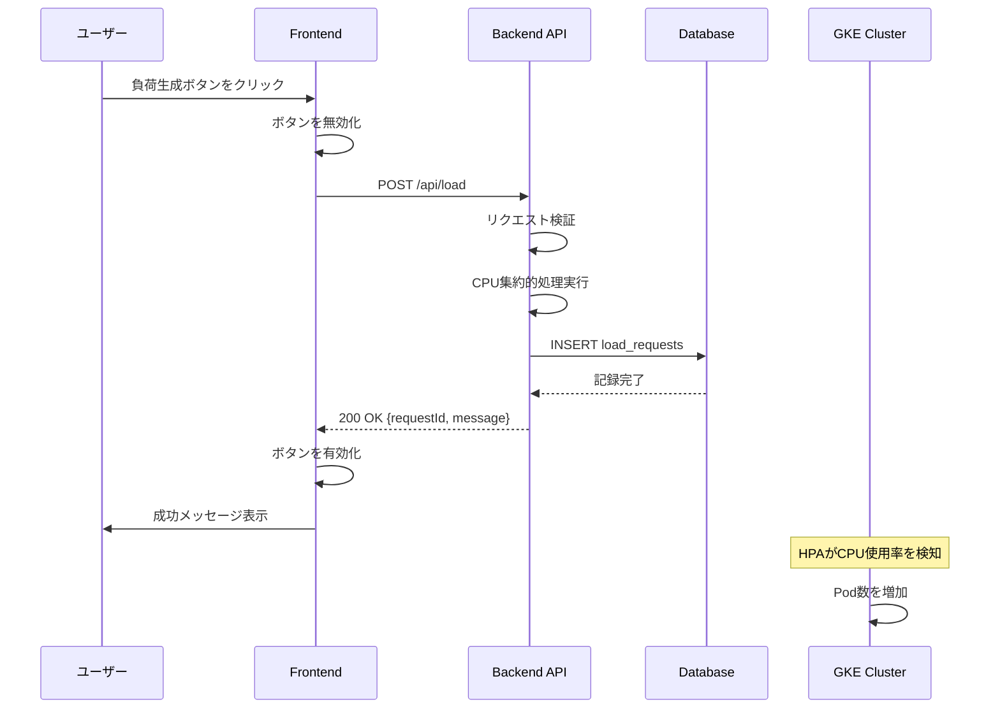
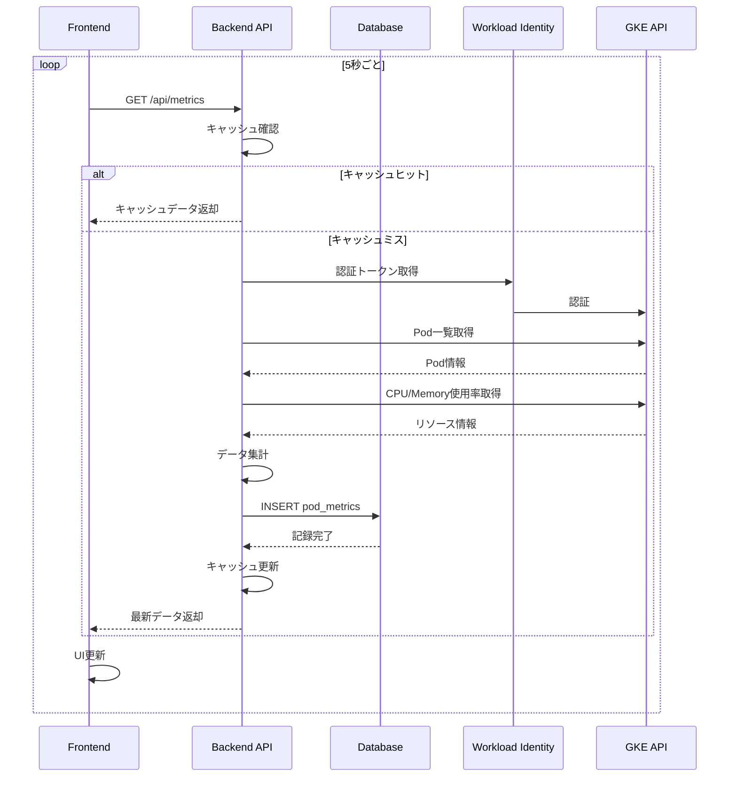
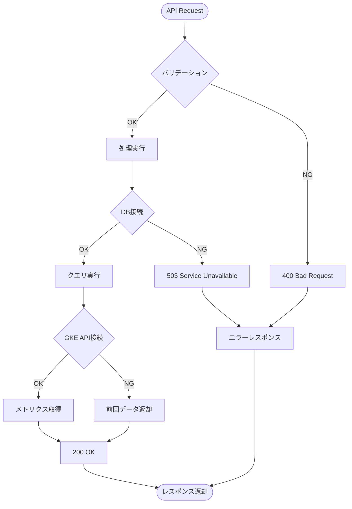
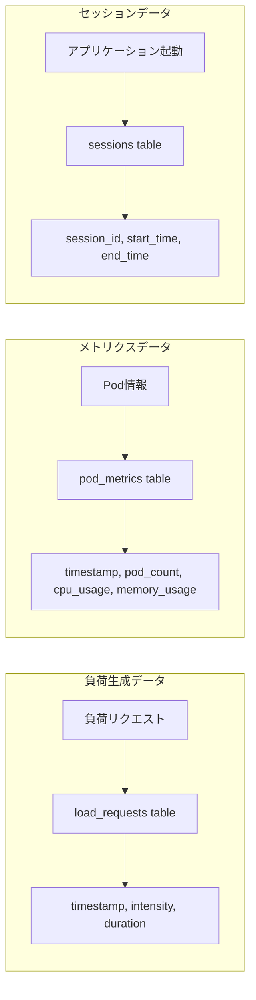
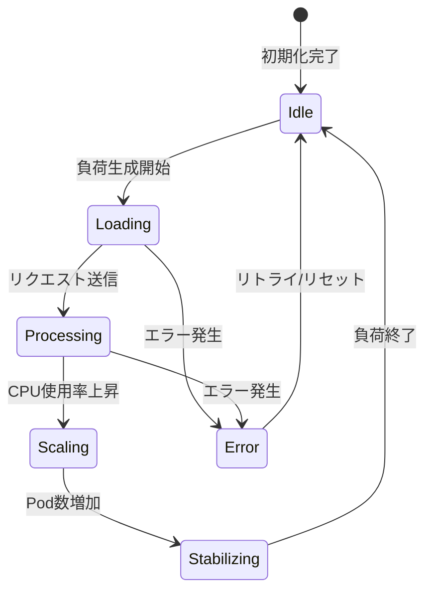
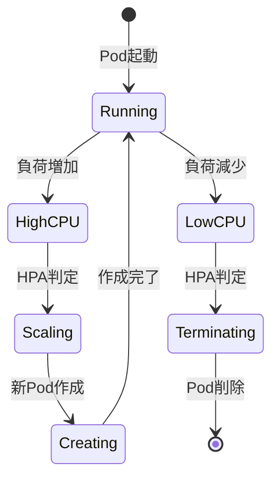
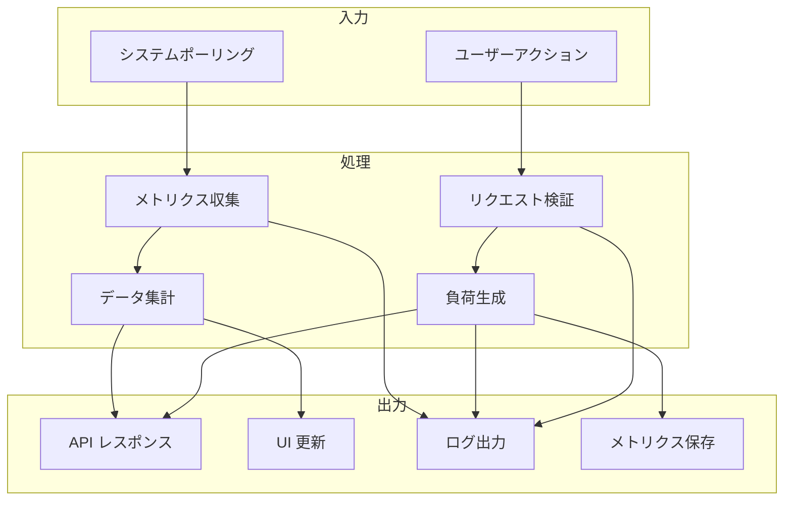
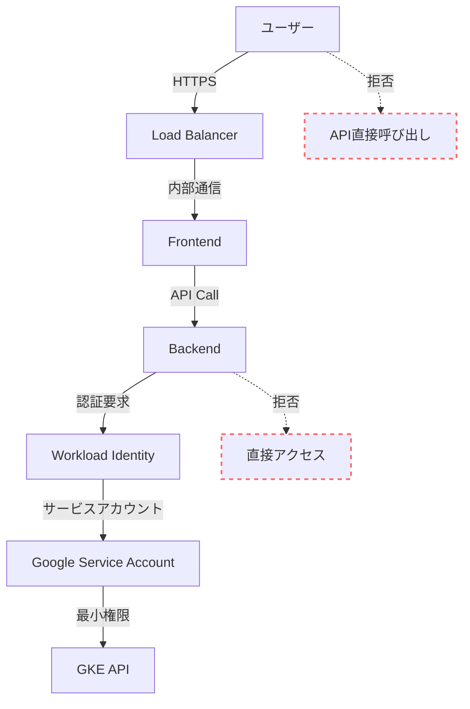

# データフロー図

## システム全体のデータフロー

```mermaid
flowchart TD
    U[ユーザー] -->|1. アクセス| LB[Cloud Load Balancer]
    LB -->|2. HTTPS| FE[Frontend<br/>React App]
    FE -->|3. API Request| BE[Backend API]
    BE -->|4. Query| DB[(PostgreSQL)]
    BE -->|5. K8s API Call| WI[Workload Identity]
    WI -->|6. Authenticate| K8S[GKE API Server]
    K8S -->|7. Metrics| BE
    DB -->|8. Data| BE
    BE -->|9. Response| FE
    FE -->|10. Update UI| U
    
    HPA[HPA Controller] -->|Monitor| BE
    HPA -->|Scale| BE
```

## ユーザーインタラクションフロー

### 負荷生成フロー

```mermaid
sequenceDiagram
    participant U as ユーザー
    participant F as Frontend
    participant B as Backend API
    participant D as Database
    participant K as GKE Cluster
    
    U->>F: 負荷生成ボタンをクリック
    F->>F: ボタンを無効化
    F->>B: POST /api/load
    B->>B: リクエスト検証
    B->>B: CPU集約的処理実行
    B->>D: INSERT load_requests
    D-->>B: 記録完了
    B-->>F: 200 OK {requestId, message}
    F->>F: ボタンを有効化
    F->>U: 成功メッセージ表示
    
    Note over K: HPAがCPU使用率を検知
    K->>K: Pod数を増加
```

### メトリクス取得フロー（ポーリング）

```mermaid
sequenceDiagram
    participant F as Frontend
    participant B as Backend API
    participant D as Database
    participant WI as Workload Identity
    participant K as GKE API
    
    loop 5秒ごと
        F->>B: GET /api/metrics
        B->>B: キャッシュ確認
        alt キャッシュヒット
            B-->>F: キャッシュデータ返却
        else キャッシュミス
            B->>WI: 認証トークン取得
            WI->>K: 認証
            B->>K: Pod一覧取得
            K-->>B: Pod情報
            B->>K: CPU/Memory使用率取得
            K-->>B: リソース情報
            B->>B: データ集計
            B->>D: INSERT pod_metrics
            D-->>B: 記録完了
            B->>B: キャッシュ更新
            B-->>F: 最新データ返却
        end
        F->>F: UI更新
    end
```

## エラー処理フロー

```mermaid
flowchart TD
    Start([API Request]) --> Validate{バリデーション}
    Validate -->|OK| Process[処理実行]
    Validate -->|NG| Error400[400 Bad Request]
    
    Process --> DBCheck{DB接続}
    DBCheck -->|OK| DBQuery[クエリ実行]
    DBCheck -->|NG| Error503[503 Service Unavailable]
    
    DBQuery --> K8sCheck{GKE API接続}
    K8sCheck -->|OK| K8sQuery[メトリクス取得]
    K8sCheck -->|NG| Fallback[前回データ返却]
    
    K8sQuery --> Success[200 OK]
    Fallback --> Success
    
    Error400 --> ErrorResponse[エラーレスポンス]
    Error503 --> ErrorResponse
    Success --> End([レスポンス返却])
    ErrorResponse --> End
```

## データ永続化フロー

```mermaid
graph LR
    subgraph "負荷生成データ"
        A1[負荷リクエスト] --> A2[load_requests table]
        A2 --> A3[timestamp, intensity, duration]
    end
    
    subgraph "メトリクスデータ"
        B1[Pod情報] --> B2[pod_metrics table]
        B2 --> B3[timestamp, pod_count, cpu_usage, memory_usage]
    end
    
    subgraph "セッションデータ"
        C1[アプリケーション起動] --> C2[sessions table]
        C2 --> C3[session_id, start_time, end_time]
    end
```

## 状態遷移図

### アプリケーション状態

```mermaid
stateDiagram-v2
    [*] --> Idle: 初期化完了
    Idle --> Loading: 負荷生成開始
    Loading --> Processing: リクエスト送信
    Processing --> Scaling: CPU使用率上昇
    Scaling --> Stabilizing: Pod数増加
    Stabilizing --> Idle: 負荷終了
    
    Loading --> Error: エラー発生
    Processing --> Error: エラー発生
    Error --> Idle: リトライ/リセット
```

### Pod状態

```mermaid
stateDiagram-v2
    [*] --> Running: Pod起動
    Running --> HighCPU: 負荷増加
    HighCPU --> Scaling: HPA判定
    Scaling --> Creating: 新Pod作成
    Creating --> Running: 作成完了
    Running --> LowCPU: 負荷減少
    LowCPU --> Terminating: HPA判定
    Terminating --> [*]: Pod削除
```

## データ処理パイプライン

```mermaid
graph TB
    subgraph "入力"
        I1[ユーザーアクション]
        I2[システムポーリング]
    end
    
    subgraph "処理"
        P1[リクエスト検証]
        P2[負荷生成]
        P3[メトリクス収集]
        P4[データ集計]
    end
    
    subgraph "出力"
        O1[API レスポンス]
        O2[UI 更新]
        O3[ログ出力]
        O4[メトリクス保存]
    end
    
    I1 --> P1
    I2 --> P3
    P1 --> P2
    P2 --> O1
    P2 --> O4
    P3 --> P4
    P4 --> O1
    P4 --> O2
    P1 --> O3
    P2 --> O3
    P3 --> O3
```

## セキュリティフロー

```mermaid
flowchart TD
    User[ユーザー] -->|HTTPS| LB[Load Balancer]
    LB -->|内部通信| Frontend
    Frontend -->|API Call| Backend
    Backend -->|認証要求| WI[Workload Identity]
    WI -->|サービスアカウント| GSA[Google Service Account]
    GSA -->|最小権限| GKE[GKE API]
    
    Backend -.->|拒否| DirectAccess[直接アクセス]
    User -.->|拒否| DirectAPI[API直接呼び出し]
    
    style DirectAccess stroke:#f66,stroke-width:2px,stroke-dasharray: 5 5
    style DirectAPI stroke:#f66,stroke-width:2px,stroke-dasharray: 5 5
```