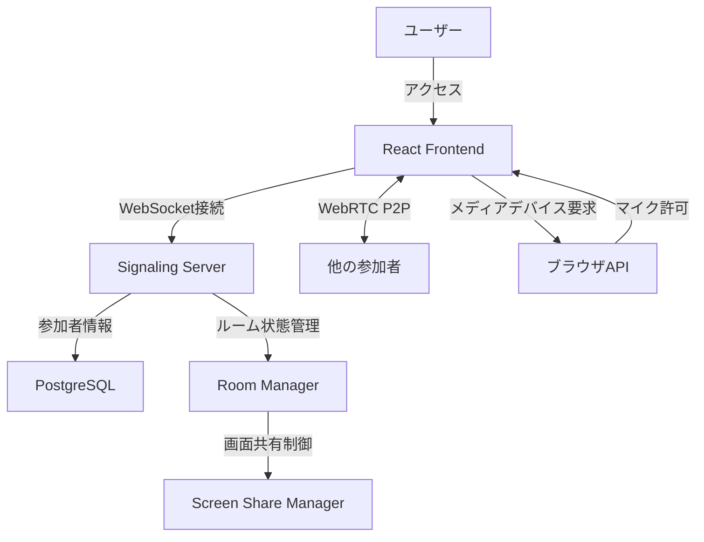
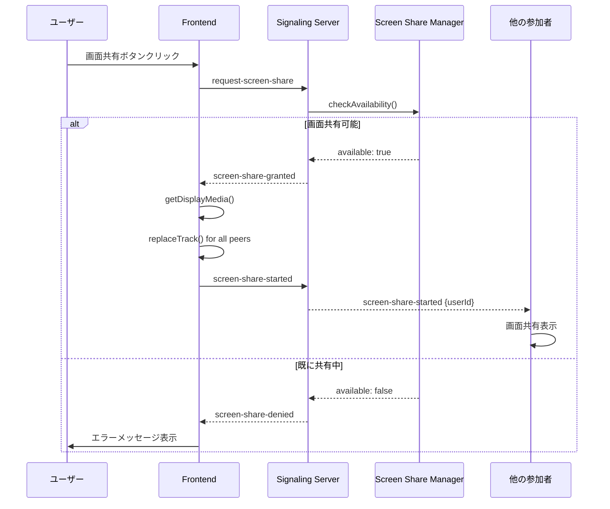
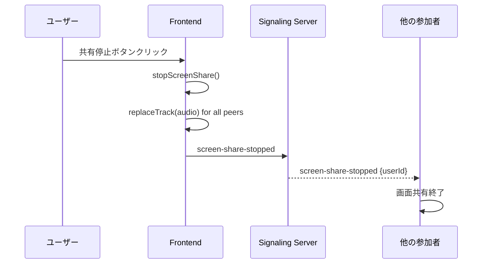
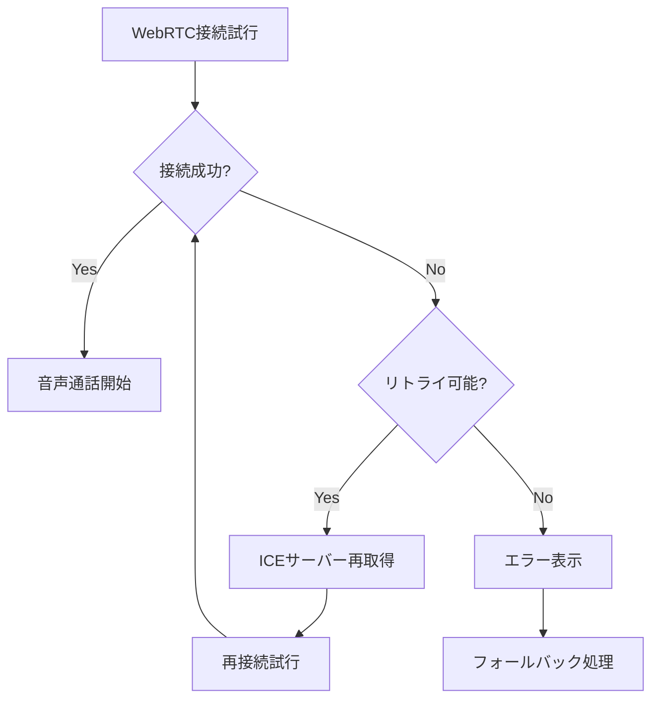
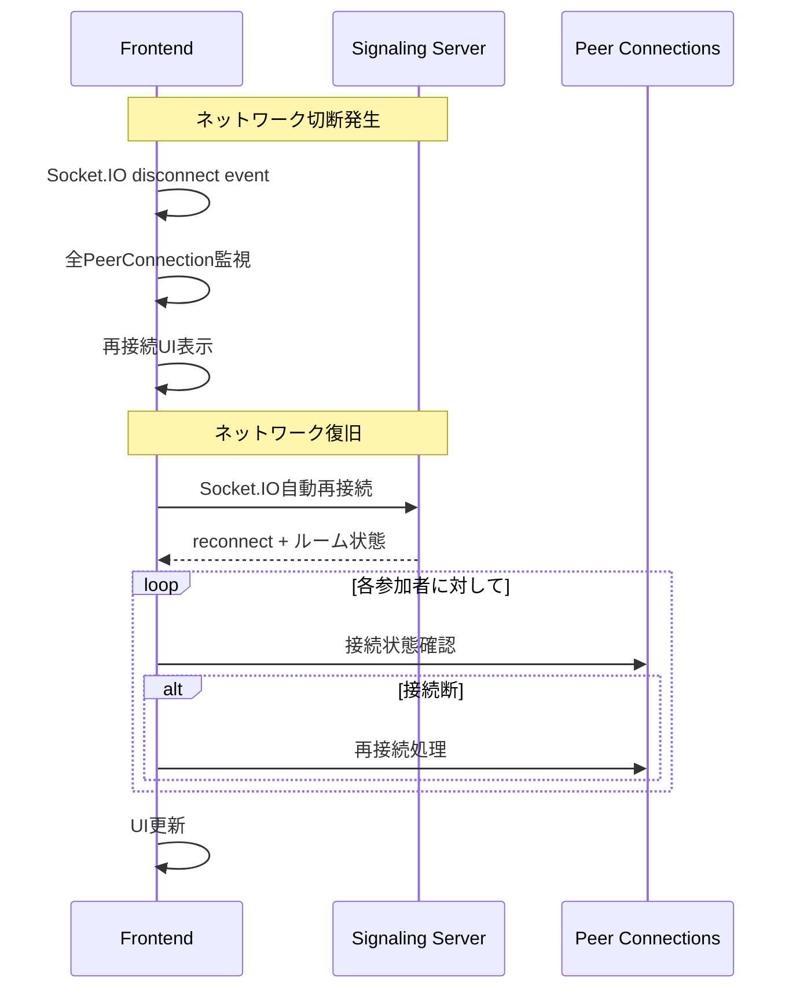
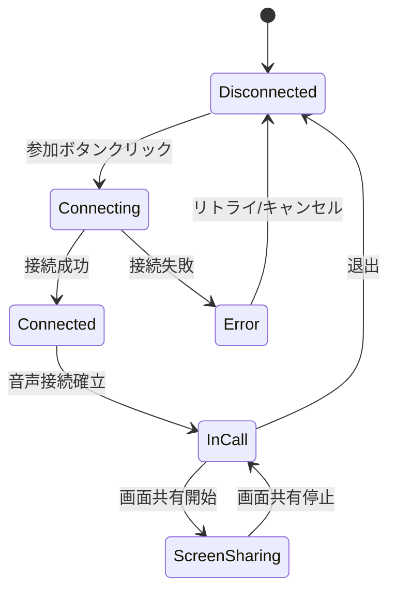
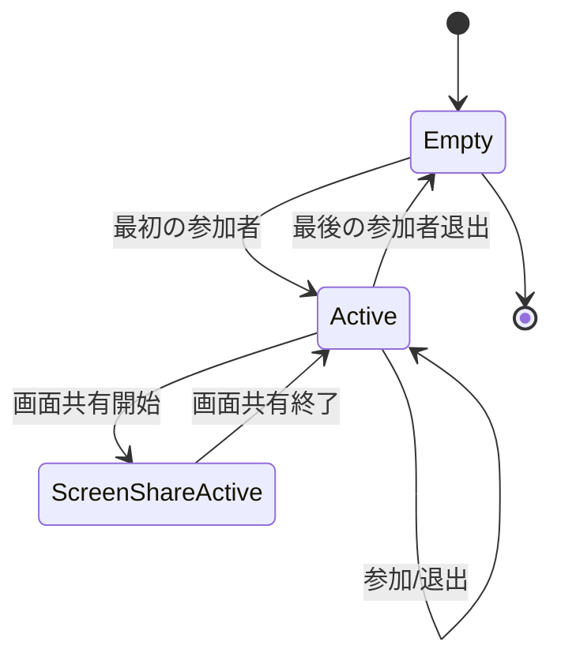
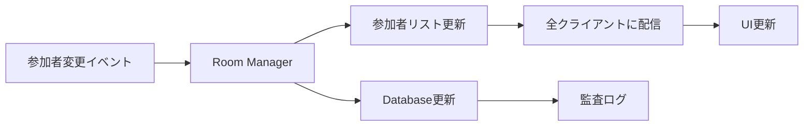
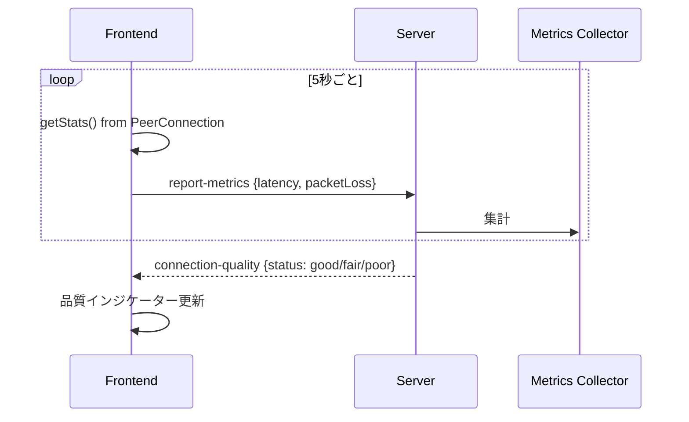

# データフロー図

## ユーザーインタラクションフロー

### 全体フロー


### 参加フロー詳細
```mermaid
sequenceDiagram
    participant U as ユーザー
    participant F as Frontend
    participant S as Signaling Server
    participant D as Database
    participant O as 他の参加者
    
    U->>F: 参加ボタンクリック
    F->>F: マイク許可要求
    F->>S: Socket.IO接続
    S->>D: セッション作成
    D-->>S: セッションID
    S->>S: ルームに参加者追加
    S-->>F: 参加成功 + 参加者リスト
    S-->>O: 新規参加者通知
    
    Note over F,O: WebRTC接続確立開始
    F->>O: WebRTC Offer (via S)
    O->>F: WebRTC Answer (via S)
    F<->O: ICE候補交換 (via S)
    F<-->O: P2P音声ストリーム確立
```

## WebRTC接続確立フロー

### シグナリングシーケンス
```mermaid
sequenceDiagram
    participant A as Peer A (新規参加者)
    participant S as Signaling Server
    participant B as Peer B (既存参加者)
    
    A->>S: join-room
    S->>B: user-joined {userId: A}
    
    B->>B: createOffer()
    B->>S: offer {to: A, sdp: ...}
    S->>A: offer {from: B, sdp: ...}
    
    A->>A: createAnswer()
    A->>S: answer {to: B, sdp: ...}
    S->>B: answer {from: A, sdp: ...}
    
    A->>S: ice-candidate {to: B, candidate: ...}
    S->>B: ice-candidate {from: A, candidate: ...}
    
    B->>S: ice-candidate {to: A, candidate: ...}
    S->>A: ice-candidate {from: B, candidate: ...}
    
    Note over A,B: P2P接続確立完了
    A<-->B: 音声ストリーム (直接通信)
```

## 画面共有フロー

### 画面共有開始シーケンス


### 画面共有停止シーケンス


## エラー処理フロー

### 接続エラー処理


### ネットワーク切断・再接続フロー


## 状態管理フロー

### クライアント側状態管理


### サーバー側ルーム状態管理


## データ同期フロー

### 参加者リスト同期


### リアルタイムメトリクス更新
