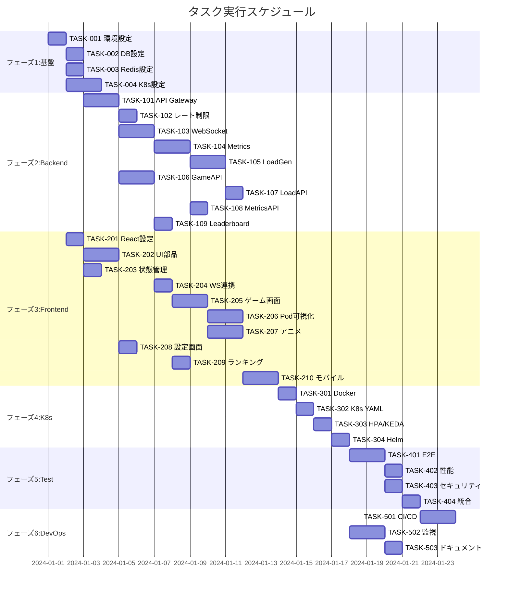

# 負荷テストシミュレーション 実装タスク

## 概要

全タスク数: 42
推定作業時間: 160時間（20人日）
クリティカルパス: TASK-001 → TASK-002 → TASK-003 → TASK-101 → TASK-201 → TASK-301 → TASK-401

## タスク一覧

### フェーズ1: 基盤構築（推定：24時間）

#### TASK-001: 開発環境セットアップ

- [ ] **タスク完了**
- **タスクタイプ**: DIRECT
- **要件リンク**: REQ-401, REQ-405
- **依存タスク**: なし
- **実装詳細**:
  - Docker Compose設定ファイルの作成
  - 開発用環境変数ファイル（.env.development）の作成
  - Makefileの作成（共通コマンド定義）
  - README.mdの作成（セットアップ手順）
- **テスト要件**:
  - [ ] Docker Composeが正常に起動する
  - [ ] すべてのサービスが疎通確認できる
- **完了条件**:
  - [ ] `docker-compose up`で全サービスが起動する
  - [ ] 開発環境のドキュメントが整備されている

#### TASK-002: データベース初期設定

- [ ] **タスク完了**
- **タスクタイプ**: DIRECT
- **要件リンク**: REQ-401
- **依存タスク**: TASK-001
- **実装詳細**:
  - PostgreSQL Dockerコンテナ設定
  - TimescaleDB拡張の有効化
  - database-schema.sqlの実行スクリプト
  - マイグレーションツール（Flyway/Liquibase）設定
- **テスト要件**:
  - [ ] データベース接続テスト
  - [ ] 全テーブル作成確認
  - [ ] インデックス作成確認
- **完了条件**:
  - [ ] PostgreSQLが起動している
  - [ ] 全テーブルとインデックスが作成されている
  - [ ] マイグレーションが実行可能

#### TASK-003: Redis設定

- [ ] **タスク完了**
- **タスクタイプ**: DIRECT
- **要件リンク**: REQ-005
- **依存タスク**: TASK-001
- **実装詳細**:
  - Redis Dockerコンテナ設定
  - Redis設定ファイル（永続化、メモリ制限）
  - Redis Sentinelの設定（高可用性）
- **テスト要件**:
  - [ ] Redis接続テスト
  - [ ] Pub/Sub動作確認
  - [ ] 永続化動作確認
- **完了条件**:
  - [ ] Redisが起動している
  - [ ] Pub/Sub機能が動作する

#### TASK-004: Kubernetes開発環境

- [ ] **タスク完了**
- **タスクタイプ**: DIRECT
- **要件リンク**: REQ-401, REQ-402, REQ-403
- **依存タスク**: TASK-001
- **実装詳細**:
  - Minikube/Kind設定
  - サンプルDeployment YAML作成
  - HPA設定ファイル作成
  - KEDA設定ファイル作成
  - ServiceAccount/RBAC設定
- **テスト要件**:
  - [ ] クラスター起動確認
  - [ ] Pod作成・削除確認
  - [ ] HPA動作確認
- **完了条件**:
  - [ ] ローカルK8sクラスターが起動する
  - [ ] HPAが設定できる
  - [ ] Kubernetes APIにアクセスできる

### フェーズ2: バックエンドコア実装（推定：48時間）

#### TASK-101: API Gateway基本実装

- [ ] **タスク完了**
- **タスクタイプ**: TDD
- **要件リンク**: REQ-001, REQ-002, NFR-101, NFR-102
- **依存タスク**: TASK-002, TASK-003
- **実装詳細**:
  - Express + TypeScript プロジェクト初期化
  - ミドルウェア設定（CORS、ボディパーサー、ログ）
  - エラーハンドリング共通処理
  - ヘルスチェックエンドポイント
  - OpenAPI仕様書生成
- **テスト要件**:
  - [ ] 単体テスト: ミドルウェア動作
  - [ ] 統合テスト: HTTPリクエスト処理
  - [ ] 負荷テスト: 100同時接続
- **エラーハンドリング**:
  - [ ] 404エラー処理
  - [ ] 500エラー処理
  - [ ] バリデーションエラー
- **完了条件**:
  - [ ] `/api/health`が200を返す
  - [ ] CORSが正しく設定されている
  - [ ] エラーレスポンスが統一されている

#### TASK-102: レート制限実装

- [ ] **タスク完了**
- **タスクタイプ**: TDD
- **要件リンク**: NFR-102
- **依存タスク**: TASK-101, TASK-003
- **実装詳細**:
  - express-rate-limitの設定
  - Redis連携（分散環境対応）
  - IPベース・セッションベース制限
  - カスタムレート制限ルール
  - レート制限ヘッダー追加
- **テスト要件**:
  - [ ] 単体テスト: レート制限ロジック
  - [ ] 統合テスト: 制限超過時の429レスポンス
  - [ ] パフォーマンステスト
- **完了条件**:
  - [ ] レート制限が動作する
  - [ ] 適切なヘッダーが返される
  - [ ] Redis連携が動作する

#### TASK-103: WebSocketサービス実装

- [ ] **タスク完了**
- **タスクタイプ**: TDD
- **要件リンク**: REQ-005, REQ-003, NFR-002
- **依存タスク**: TASK-101, TASK-003
- **実装詳細**:
  - Socket.ioサーバー設定
  - Redis Adapter設定（スケーリング対応）
  - イベントハンドラー実装
  - 認証・認可処理
  - 自動再接続処理
  - ハートビート実装
- **テスト要件**:
  - [ ] 単体テスト: イベントハンドラー
  - [ ] 統合テスト: 接続・切断処理
  - [ ] 負荷テスト: 1000同時接続
- **エラーハンドリング**:
  - [ ] 接続エラー処理
  - [ ] 認証エラー処理
  - [ ] タイムアウト処理
- **完了条件**:
  - [ ] WebSocket接続が確立できる
  - [ ] イベントの送受信ができる
  - [ ] 自動再接続が動作する

#### TASK-104: Metrics Collectorサービス実装

- [ ] **タスク完了**
- **タスクタイプ**: TDD
- **要件リンク**: REQ-003, REQ-403, NFR-002
- **依存タスク**: TASK-004, TASK-103
- **実装詳細**:
  - Go言語プロジェクト初期化
  - client-go設定
  - Pod Watch API実装
  - メトリクス集計ロジック
  - Redis Pub/Sub連携
  - Prometheusメトリクス公開
- **テスト要件**:
  - [ ] 単体テスト: メトリクス計算
  - [ ] 統合テスト: K8s API連携
  - [ ] モックテスト: K8s APIモック
- **完了条件**:
  - [ ] Pod数を取得できる
  - [ ] リアルタイム更新が動作する
  - [ ] Redisに公開できる

#### TASK-105: Load Generatorサービス実装

- [ ] **タスク完了**
- **タスクタイプ**: TDD
- **要件リンク**: REQ-002, REQ-101
- **依存タスク**: TASK-104
- **実装詳細**:
  - Go言語プロジェクト初期化
  - 負荷生成ロジック（CPU/メモリ）
  - ワーカープール実装
  - キューイング処理
  - 負荷パターン実装（定常、スパイク、波形）
  - グレースフルシャットダウン
- **テスト要件**:
  - [ ] 単体テスト: 負荷生成ロジック
  - [ ] 負荷テスト: CPU使用率確認
  - [ ] スケーリングテスト: HPA連携
- **完了条件**:
  - [ ] 負荷を生成できる
  - [ ] HPAがトリガーされる
  - [ ] 安全に停止できる

#### TASK-106: ゲーム管理API実装

- [ ] **タスク完了**
- **タスクタイプ**: TDD
- **要件リンク**: REQ-004, REQ-101～105
- **依存タスク**: TASK-101, TASK-002
- **実装詳細**:
  - ゲームセッション管理
  - 状態遷移ロジック
  - スコア計算ロジック
  - 爆弾カウントダウン処理
  - ゲーム設定管理
  - 実績解除判定
- **テスト要件**:
  - [ ] 単体テスト: 状態遷移
  - [ ] 単体テスト: スコア計算
  - [ ] 統合テスト: ゲームフロー
- **エラーハンドリング**:
  - [ ] 無効な状態遷移
  - [ ] セッションタイムアウト
  - [ ] 同時実行制御
- **完了条件**:
  - [ ] ゲームを開始・終了できる
  - [ ] 状態遷移が正しく動作する
  - [ ] スコアが計算される

#### TASK-107: 負荷生成API実装

- [ ] **タスク完了**
- **タスクタイプ**: TDD
- **要件リンク**: REQ-002, NFR-102, NFR-103
- **依存タスク**: TASK-105, TASK-102
- **実装詳細**:
  - 負荷リクエストバリデーション
  - Load Generatorサービス連携
  - キュー管理
  - 負荷メトリクス取得
  - レート制限適用
- **テスト要件**:
  - [ ] 単体テスト: バリデーション
  - [ ] 統合テスト: サービス連携
  - [ ] セキュリティテスト: インジェクション対策
- **完了条件**:
  - [ ] 負荷生成APIが動作する
  - [ ] レート制限が適用される
  - [ ] キューイングが動作する

#### TASK-108: メトリクスAPI実装

- [ ] **タスク完了**
- **タスクタイプ**: TDD
- **要件リンク**: REQ-003, NFR-002
- **依存タスク**: TASK-104, TASK-002
- **実装詳細**:
  - Pod メトリクス取得エンドポイント
  - 履歴データ取得エンドポイント
  - 集計処理実装
  - キャッシュ戦略実装
  - ページネーション実装
- **テスト要件**:
  - [ ] 単体テスト: 集計ロジック
  - [ ] 統合テスト: データベース連携
  - [ ] パフォーマンステスト: 大量データ
- **完了条件**:
  - [ ] メトリクスを取得できる
  - [ ] 履歴データを取得できる
  - [ ] キャッシュが動作する

#### TASK-109: リーダーボードAPI実装

- [ ] **タスク完了**
- **タスクタイプ**: TDD
- **要件リンク**: REQ-302
- **依存タスク**: TASK-106, TASK-002
- **実装詳細**:
  - ランキング計算ロジック
  - マテリアライズドビュー更新
  - 期間別ランキング
  - ユーザーランク取得
  - キャッシュ実装
- **テスト要件**:
  - [ ] 単体テスト: ランキング計算
  - [ ] 統合テスト: DB連携
  - [ ] パフォーマンステスト
- **完了条件**:
  - [ ] ランキングが表示される
  - [ ] 期間別フィルタが動作する
  - [ ] パフォーマンスが良好

### フェーズ3: フロントエンド実装（推定：48時間）

#### TASK-201: Reactプロジェクト初期設定

- [ ] **タスク完了**
- **タスクタイプ**: DIRECT
- **要件リンク**: REQ-404, REQ-405
- **依存タスク**: TASK-001
- **実装詳細**:
  - Vite + React + TypeScript設定
  - Tailwind CSS設定
  - ESLint/Prettier設定
  - 環境変数設定
  - ルーティング設定（React Router）
  - 国際化設定（i18n）
- **テスト要件**:
  - [ ] ビルド成功確認
  - [ ] 開発サーバー起動確認
  - [ ] Linting動作確認
- **完了条件**:
  - [ ] 開発環境が起動する
  - [ ] ビルドが成功する
  - [ ] TypeScriptエラーがない

#### TASK-202: 共通UIコンポーネント実装

- [ ] **タスク完了**
- **タスクタイプ**: TDD
- **要件リンク**: NFR-201, NFR-203, NFR-204
- **依存タスク**: TASK-201
- **実装詳細**:
  - ボタンコンポーネント
  - カードコンポーネント
  - モーダルコンポーネント
  - ローディングコンポーネント
  - エラー表示コンポーネント
  - トースト通知コンポーネント
- **UI/UX要件**:
  - [ ] ローディング状態: スケルトンスクリーン
  - [ ] エラー表示: 分かりやすいメッセージ
  - [ ] モバイル対応: タッチ操作最適化
  - [ ] アクセシビリティ: ARIA属性、キーボード操作
  - [ ] ダークモード対応
- **テスト要件**:
  - [ ] コンポーネントテスト（React Testing Library）
  - [ ] スナップショットテスト
  - [ ] アクセシビリティテスト
- **完了条件**:
  - [ ] Storybookで確認できる
  - [ ] レスポンシブ対応完了
  - [ ] アクセシビリティ基準クリア

#### TASK-203: 状態管理実装

- [ ] **タスク完了**
- **タスクタイプ**: TDD
- **要件リンク**: REQ-003, REQ-005
- **依存タスク**: TASK-201
- **実装詳細**:
  - Zustand設定
  - ゲーム状態ストア
  - メトリクス状態ストア
  - UI状態ストア
  - WebSocket状態ストア
  - 永続化設定
- **テスト要件**:
  - [ ] 単体テスト: ストアロジック
  - [ ] 統合テスト: 状態更新フロー
- **完了条件**:
  - [ ] 状態管理が動作する
  - [ ] 状態の永続化が動作する
  - [ ] TypeScript型が正しい

#### TASK-204: WebSocket連携実装

- [ ] **タスク完了**
- **タスクタイプ**: TDD
- **要件リンク**: REQ-005, NFR-002, NFR-004
- **依存タスク**: TASK-203, TASK-103
- **実装詳細**:
  - Socket.io-client設定
  - 接続管理Hook
  - イベントリスナー設定
  - 自動再接続処理
  - エラーハンドリング
  - 接続状態表示
- **UI/UX要件**:
  - [ ] 接続状態インジケーター
  - [ ] 再接続中の表示
  - [ ] オフライン時の通知
- **テスト要件**:
  - [ ] 単体テスト: Hook動作
  - [ ] 統合テスト: サーバー連携
  - [ ] エラーケーステスト
- **完了条件**:
  - [ ] WebSocket接続が確立する
  - [ ] リアルタイム更新が動作する
  - [ ] 自動再接続が動作する

#### TASK-205: ゲーム画面実装

- [ ] **タスク完了**
- **タスクタイプ**: TDD
- **要件リンク**: REQ-001, REQ-004, REQ-101～105
- **依存タスク**: TASK-202, TASK-203, TASK-204
- **実装詳細**:
  - ゲームメイン画面レイアウト
  - 負荷ボタンコンポーネント
  - 爆弾表示コンポーネント
  - カウントダウンタイマー
  - スコア表示
  - ゲーム状態表示
- **UI/UX要件**:
  - [ ] ローディング状態: ボタン無効化
  - [ ] エラー表示: トースト通知
  - [ ] モバイル対応: タッチ最適化
  - [ ] アニメーション: Framer Motion
  - [ ] 音響効果（オプション）
- **テスト要件**:
  - [ ] コンポーネントテスト
  - [ ] インタラクションテスト
  - [ ] レスポンシブテスト
- **完了条件**:
  - [ ] ゲーム画面が表示される
  - [ ] ボタンクリックが動作する
  - [ ] 状態遷移が正しい

#### TASK-206: Pod監視ビジュアライゼーション

- [ ] **タスク完了**
- **タスクタイプ**: TDD
- **要件リンク**: REQ-003, NFR-202
- **依存タスク**: TASK-204, TASK-108
- **実装詳細**:
  - Pod数表示コンポーネント
  - リアルタイムグラフ（Chart.js/D3.js）
  - スケーリングアニメーション
  - メトリクス詳細表示
  - 履歴グラフ表示
- **UI/UX要件**:
  - [ ] スムーズなアニメーション
  - [ ] 視覚的なフィードバック
  - [ ] 色分けによる状態表示
  - [ ] ツールチップ表示
- **テスト要件**:
  - [ ] レンダリングテスト
  - [ ] データ更新テスト
  - [ ] パフォーマンステスト
- **完了条件**:
  - [ ] Pod数がリアルタイム表示される
  - [ ] グラフが描画される
  - [ ] アニメーションが動作する

#### TASK-207: 爆弾アニメーション実装

- [ ] **タスク完了**
- **タスクタイプ**: TDD
- **要件リンク**: REQ-103, REQ-104, NFR-202
- **依存タスク**: TASK-205
- **実装詳細**:
  - 爆弾コンポーネント
  - カウントダウンアニメーション
  - 爆発エフェクト（Lottie/CSS）
  - 成功時のエフェクト
  - 画面シェイク効果
  - パーティクルエフェクト
- **UI/UX要件**:
  - [ ] 緊張感のある演出
  - [ ] 段階的な危険度表示
  - [ ] インパクトのある爆発
  - [ ] 成功時の達成感
- **テスト要件**:
  - [ ] アニメーション動作確認
  - [ ] パフォーマンステスト
  - [ ] ブラウザ互換性テスト
- **完了条件**:
  - [ ] カウントダウンが表示される
  - [ ] 爆発アニメーションが再生される
  - [ ] パフォーマンスが良好

#### TASK-208: 設定画面実装

- [ ] **タスク完了**
- **タスクタイプ**: TDD
- **要件リンク**: REQ-301, REQ-303
- **依存タスク**: TASK-202
- **実装詳細**:
  - 設定モーダル/ページ
  - 難易度選択
  - 音量調整
  - テーマ切り替え
  - 言語選択
  - プロフィール設定
- **UI/UX要件**:
  - [ ] 直感的な設定UI
  - [ ] リアルタイムプレビュー
  - [ ] 設定の永続化
- **テスト要件**:
  - [ ] 設定変更テスト
  - [ ] 永続化テスト
  - [ ] UIテスト
- **完了条件**:
  - [ ] 設定が変更できる
  - [ ] 設定が保存される
  - [ ] UIが使いやすい

#### TASK-209: リーダーボード画面実装

- [ ] **タスク完了**
- **タスクタイプ**: TDD
- **要件リンク**: REQ-302
- **依存タスク**: TASK-109, TASK-202
- **実装詳細**:
  - リーダーボードページ
  - ランキング表示
  - フィルター機能
  - ページネーション
  - ユーザーハイライト
  - 詳細統計表示
- **UI/UX要件**:
  - [ ] 見やすいランキング表示
  - [ ] スムーズなページ遷移
  - [ ] モバイル最適化
  - [ ] ローディング状態
- **テスト要件**:
  - [ ] データ取得テスト
  - [ ] フィルター動作テスト
  - [ ] ページネーションテスト
- **完了条件**:
  - [ ] ランキングが表示される
  - [ ] フィルターが動作する
  - [ ] ページネーションが動作する

#### TASK-210: モバイル最適化

- [ ] **タスク完了**
- **タスクタイプ**: TDD
- **要件リンク**: NFR-203, NFR-204
- **依存タスク**: TASK-205, TASK-206, TASK-207
- **実装詳細**:
  - タッチ操作最適化
  - ビューポート設定
  - レスポンシブレイアウト調整
  - モバイル専用UI
  - パフォーマンス最適化
  - PWA対応
- **UI/UX要件**:
  - [ ] タップ領域の最適化
  - [ ] スワイプジェスチャー
  - [ ] 画面回転対応
  - [ ] オフライン対応
- **テスト要件**:
  - [ ] 実機テスト（iOS/Android）
  - [ ] レスポンシブテスト
  - [ ] パフォーマンステスト
- **完了条件**:
  - [ ] モバイルで快適に動作する
  - [ ] タッチ操作が最適化されている
  - [ ] PWAとしてインストール可能

### フェーズ4: Kubernetes統合（推定：24時間）

#### TASK-301: Dockerイメージ作成

- [ ] **タスク完了**
- **タスクタイプ**: DIRECT
- **要件リンク**: REQ-401
- **依存タスク**: TASK-105, TASK-210
- **実装詳細**:
  - マルチステージDockerfile作成（各サービス）
  - ビルド最適化
  - セキュリティスキャン設定
  - イメージサイズ最適化
  - ヘルスチェック設定
- **テスト要件**:
  - [ ] イメージビルド成功
  - [ ] コンテナ起動確認
  - [ ] セキュリティスキャン合格
- **完了条件**:
  - [ ] 全サービスのイメージが作成される
  - [ ] イメージサイズが最適化されている
  - [ ] セキュリティ脆弱性がない

#### TASK-302: Kubernetes マニフェスト作成

- [ ] **タスク完了**
- **タスクタイプ**: DIRECT
- **要件リンク**: REQ-401, REQ-402
- **依存タスク**: TASK-301
- **実装詳細**:
  - Deployment YAML（各サービス）
  - Service YAML
  - ConfigMap/Secret YAML
  - Ingress YAML
  - NetworkPolicy YAML
  - PodDisruptionBudget
- **テスト要件**:
  - [ ] マニフェスト検証（kubeval）
  - [ ] デプロイテスト
  - [ ] 接続テスト
- **完了条件**:
  - [ ] 全リソースがデプロイできる
  - [ ] サービス間通信が動作する
  - [ ] 外部からアクセスできる

#### TASK-303: HPA/KEDA設定

- [ ] **タスク完了**
- **タスクタイプ**: DIRECT
- **要件リンク**: REQ-402, REQ-101
- **依存タスク**: TASK-302
- **実装詳細**:
  - HPA設定（CPU/メモリベース）
  - KEDA設定（カスタムメトリクス）
  - ScaledObject定義
  - メトリクスサーバー設定
  - スケーリングポリシー設定
- **テスト要件**:
  - [ ] HPA動作確認
  - [ ] KEDA動作確認
  - [ ] 負荷テストによるスケーリング確認
- **完了条件**:
  - [ ] 自動スケーリングが動作する
  - [ ] 負荷に応じてPod数が変動する
  - [ ] スケールダウンも正常動作

#### TASK-304: Helm Chart作成

- [ ] **タスク完了**
- **タスクタイプ**: DIRECT
- **要件リンク**: REQ-401
- **依存タスク**: TASK-302, TASK-303
- **実装詳細**:
  - Chart.yaml作成
  - values.yaml作成（環境別）
  - テンプレート作成
  - ヘルパー関数定義
  - アップグレード戦略定義
  - ドキュメント作成
- **テスト要件**:
  - [ ] Helm lint合格
  - [ ] ドライランテスト
  - [ ] インストール/アップグレードテスト
- **完了条件**:
  - [ ] Helmでデプロイできる
  - [ ] 環境別設定が動作する
  - [ ] アップグレードが安全

### フェーズ5: 統合・テスト（推定：16時間）

#### TASK-401: E2Eテストスイート実装

- [ ] **タスク完了**
- **タスクタイプ**: TDD
- **要件リンク**: 全機能要件
- **依存タスク**: TASK-210, TASK-304
- **実装詳細**:
  - Playwright/Cypress設定
  - ゲームフロー全体テスト
  - 負荷生成シナリオテスト
  - スケーリング確認テスト
  - エラーリカバリーテスト
  - クロスブラウザテスト
- **テスト要件**:
  - [ ] 主要ユーザーフロー網羅
  - [ ] エッジケース確認
  - [ ] パフォーマンス基準達成
- **完了条件**:
  - [ ] 全E2Eテスト合格
  - [ ] CI/CD統合完了
  - [ ] テストレポート生成

#### TASK-402: パフォーマンステスト

- [ ] **タスク完了**
- **タスクタイプ**: TDD
- **要件リンク**: NFR-001, NFR-002, NFR-003
- **依存タスク**: TASK-401
- **実装詳細**:
  - k6/JMeter設定
  - 負荷シナリオ作成
  - 100同時ユーザーテスト
  - レスポンスタイム測定
  - リソース使用率監視
  - ボトルネック分析
- **テスト要件**:
  - [ ] 100同時ユーザー処理
  - [ ] Pod更新1秒以内
  - [ ] クリック応答100ms以内
- **完了条件**:
  - [ ] パフォーマンス基準達成
  - [ ] ボトルネック特定・解決
  - [ ] 最適化完了

#### TASK-403: セキュリティテスト

- [ ] **タスク完了**
- **タスクタイプ**: TDD
- **要件リンク**: NFR-101, NFR-102, NFR-103, NFR-104
- **依存タスク**: TASK-401
- **実装詳細**:
  - OWASP ZAP設定
  - 脆弱性スキャン
  - ペネトレーションテスト
  - XSS/CSRF対策確認
  - SQLインジェクション対策確認
  - 認証・認可テスト
- **テスト要件**:
  - [ ] 既知の脆弱性なし
  - [ ] セキュリティヘッダー確認
  - [ ] 入力検証動作確認
- **完了条件**:
  - [ ] セキュリティ基準クリア
  - [ ] 脆弱性対策完了
  - [ ] セキュリティレポート作成

#### TASK-404: 統合テスト実施

- [ ] **タスク完了**
- **タスクタイプ**: TDD
- **要件リンク**: 全要件
- **依存タスク**: TASK-402, TASK-403
- **実装詳細**:
  - システム全体の結合テスト
  - サービス間連携テスト
  - データ整合性テスト
  - 障害回復テスト
  - ロールバックテスト
  - 本番環境シミュレーション
- **テスト要件**:
  - [ ] 全機能の動作確認
  - [ ] エラーケース網羅
  - [ ] 回復性確認
- **完了条件**:
  - [ ] 全テスト合格
  - [ ] 本番環境準備完了
  - [ ] デプロイ手順書完成

### フェーズ6: CI/CD・運用準備（推定：16時間）

#### TASK-501: CI/CDパイプライン構築

- [ ] **タスク完了**
- **タスクタイプ**: DIRECT
- **要件リンク**: 非機能要件全般
- **依存タスク**: TASK-404
- **実装詳細**:
  - GitHub Actions/GitLab CI設定
  - ビルドパイプライン
  - テスト自動実行
  - コンテナレジストリ連携
  - ArgoCD設定
  - ブランチ戦略定義
- **テスト要件**:
  - [ ] パイプライン動作確認
  - [ ] 自動デプロイ確認
  - [ ] ロールバック確認
- **完了条件**:
  - [ ] CI/CDが自動実行される
  - [ ] デプロイが自動化される
  - [ ] ロールバックが可能

#### TASK-502: 監視・ログ設定

- [ ] **タスク完了**
- **タスクタイプ**: DIRECT
- **要件リンク**: NFR-301, NFR-302
- **依存タスク**: TASK-304
- **実装詳細**:
  - Prometheus設定
  - Grafanaダッシュボード作成
  - アラート設定
  - Fluentd/Fluent Bit設定
  - ログ集約設定
  - トレーシング設定（Jaeger）
- **テスト要件**:
  - [ ] メトリクス収集確認
  - [ ] アラート動作確認
  - [ ] ログ収集確認
- **完了条件**:
  - [ ] 監視が機能している
  - [ ] アラートが通知される
  - [ ] ログが集約される

#### TASK-503: ドキュメント作成

- [ ] **タスク完了**
- **タスクタイプ**: DIRECT
- **要件リンク**: 全要件
- **依存タスク**: TASK-502
- **実装詳細**:
  - API仕様書（OpenAPI）
  - デプロイ手順書
  - 運用手順書
  - トラブルシューティングガイド
  - アーキテクチャ図更新
  - README更新
- **テスト要件**:
  - [ ] ドキュメントレビュー
  - [ ] 手順書の動作確認
- **完了条件**:
  - [ ] ドキュメントが完成
  - [ ] 手順が明確
  - [ ] 運用可能な状態

## 実行順序

## 並行実行可能タスクグループ

### グループA（初期並行作業）
- TASK-002: データベース設定
- TASK-003: Redis設定
- TASK-004: Kubernetes設定
- TASK-201: Reactプロジェクト設定

### グループB（バックエンド並行作業）
- TASK-106: ゲーム管理API
- TASK-104: Metrics Collector（TASK-103完了後）

### グループC（フロントエンド並行作業）
- TASK-202: 共通UIコンポーネント
- TASK-203: 状態管理
- TASK-208: 設定画面

### グループD（テスト並行作業）
- TASK-402: パフォーマンステスト
- TASK-403: セキュリティテスト
- TASK-502: 監視・ログ設定

## マイルストーン

1. **M1: 基盤構築完了**（3日目）
   - 開発環境が整備される
   - データベース・Redisが起動する
   - Kubernetesローカル環境が動作する

2. **M2: バックエンドAPI完成**（10日目）
   - 全APIエンドポイントが実装される
   - WebSocket通信が確立する
   - 負荷生成・メトリクス収集が動作する

3. **M3: フロントエンド完成**（16日目）
   - ゲーム画面が完成する
   - リアルタイム更新が動作する
   - モバイル対応が完了する

4. **M4: Kubernetes統合完了**（18日目）
   - コンテナ化が完了する
   - 自動スケーリングが動作する
   - Helmデプロイが可能になる

5. **M5: リリース準備完了**（20日目）
   - 全テストが合格する
   - CI/CDパイプラインが稼働する
   - ドキュメントが完成する

## リスクと対策

### 技術的リスク
1. **Kubernetes API権限不足**
   - 対策: ServiceAccount/RBAC設定を早期に検証

2. **WebSocketスケーリング問題**
   - 対策: Redis Adapterを使用した水平スケーリング

3. **パフォーマンス目標未達**
   - 対策: 早期の負荷テストと最適化

### スケジュールリスク
1. **依存関係によるブロッキング**
   - 対策: 並行作業可能なタスクを優先

2. **テスト期間不足**
   - 対策: TDDによる品質の作り込み

## 完了条件チェックリスト

- [ ] 全42タスクが完了している
- [ ] 全受け入れ基準を満たしている
- [ ] パフォーマンス目標を達成している
- [ ] セキュリティ基準をクリアしている
- [ ] ドキュメントが完成している
- [ ] 本番環境へのデプロイが可能である