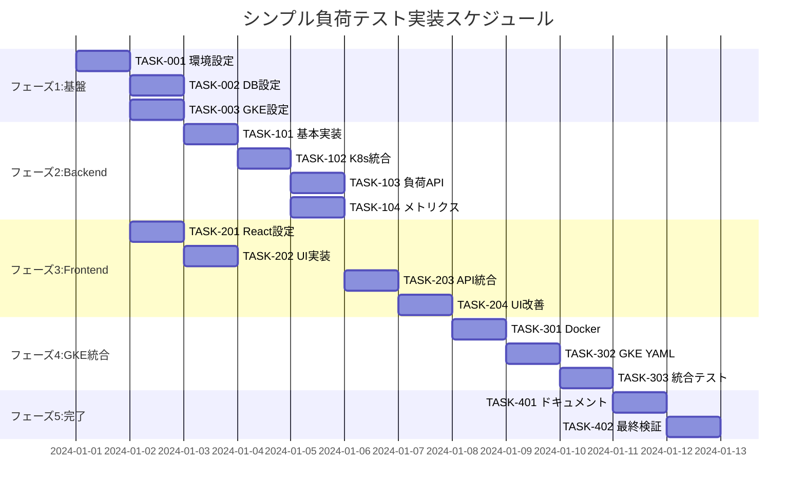

# シンプル負荷テストシミュレーション 実装タスク

## 概要

全タスク数: 15
推定作業時間: 40時間（5人日）
クリティカルパス: TASK-001 → TASK-002 → TASK-101 → TASK-201 → TASK-301

## タスク一覧

### フェーズ1: 基盤構築（推定：8時間）

#### TASK-001: 開発環境セットアップ

- [ ] **タスク完了**
- **タスクタイプ**: DIRECT
- **要件リンク**: REQ-401, REQ-403
- **依存タスク**: なし
- **実装詳細**:
  - Docker Compose設定（PostgreSQL + アプリケーション）
  - 環境変数設定（.env.development）
  - package.json/requirements.txt作成
  - 基本ディレクトリ構造作成
- **テスト要件**:
  - [ ] Docker Composeが正常起動する
  - [ ] データベースに接続できる
- **完了条件**:
  - [ ] `docker-compose up`で全サービスが起動
  - [ ] 開発環境の準備完了

#### TASK-002: データベース初期設定

- [ ] **タスク完了**
- **タスクタイプ**: DIRECT
- **要件リンク**: REQ-404
- **依存タスク**: TASK-001
- **実装詳細**:
  - PostgreSQL Dockerコンテナ設定
  - database-schema.sqlの実行
  - データベース接続設定
  - マイグレーション機能（シンプル）
- **テスト要件**:
  - [ ] 全テーブルが作成される
  - [ ] サンプルデータが挿入される
  - [ ] インデックスが作成される
- **完了条件**:
  - [ ] 3テーブル（load_requests, pod_metrics, sessions）が存在
  - [ ] JSON型が使用されていない（正規化確認）

#### TASK-003: GKE開発環境

- [ ] **タスク完了**
- **タスクタイプ**: DIRECT
- **要件リンク**: REQ-401, REQ-402, REQ-405, REQ-406
- **依存タスク**: TASK-001
- **実装詳細**:
  - GKE Autopilotクラスター作成
  - Workload Identity設定
  - 負荷対象Deployment作成（nginx）
  - HPA設定ファイル作成
  - ServiceAccount/RBAC設定
  - Artifact Registry設定
- **テスト要件**:
  - [ ] GKEクラスター接続確認
  - [ ] 負荷対象Podが起動
  - [ ] HPAが設定される
  - [ ] Workload Identityが有効
- **完了条件**:
  - [ ] `kubectl get pods`でPodが確認できる
  - [ ] HPAが動作可能な状態
  - [ ] Workload Identityが設定済み

### フェーズ2: バックエンド実装（推定：16時間）

#### TASK-101: バックエンド基本実装

- [ ] **タスク完了**
- **タスクタイプ**: TDD
- **要件リンク**: REQ-403
- **依存タスク**: TASK-002
- **実装詳細**:
  - **TypeScript版**: Express + TypeScript設定
  - **Python版**: FastAPI + uvicorn設定
  - 基本ミドルウェア（CORS、ログ、エラーハンドリング）
  - データベース接続プール
  - ヘルスチェックエンドポイント
- **テスト要件**:
  - [ ] 単体テスト: サーバー起動
  - [ ] 統合テスト: データベース接続
  - [ ] ヘルスチェック動作確認
- **エラーハンドリング**:
  - [ ] データベース接続エラー
  - [ ] 不正なリクエスト処理
- **完了条件**:
  - [ ] `GET /api/health`が200を返す
  - [ ] データベースに接続できる
  - [ ] CORSが設定されている

#### TASK-102: GKE API統合

- [ ] **タスク完了**
- **タスクタイプ**: TDD
- **要件リンク**: REQ-003, REQ-004, REQ-405
- **依存タスク**: TASK-101, TASK-003
- **実装詳細**:
  - **TypeScript版**: @kubernetes/client-node設定
  - **Python版**: kubernetes-python設定
  - Workload Identity認証設定
  - Pod数取得機能
  - CPU/メモリ使用率取得
  - スケーリング状態監視
  - GKE固有メトリクス取得
- **テスト要件**:
  - [ ] 単体テスト: GKE API呼び出し（モック）
  - [ ] 統合テスト: 実際のGKE API連携
  - [ ] Workload Identity認証テスト
  - [ ] エラーハンドリングテスト
- **エラーハンドリング**:
  - [ ] GKE API接続失敗
  - [ ] Workload Identity認証エラー
  - [ ] 権限不足エラー
  - [ ] タイムアウト処理
- **完了条件**:
  - [ ] Pod数を取得できる
  - [ ] CPU使用率を取得できる
  - [ ] Workload Identity経由で認証
  - [ ] 適切なエラーハンドリング

#### TASK-103: 負荷生成API実装

- [ ] **タスク完了**
- **タスクタイプ**: TDD
- **要件リンク**: REQ-001, REQ-002
- **依存タスク**: TASK-102
- **実装詳細**:
  - POST /api/load エンドポイント
  - 負荷生成ロジック（CPU集約的処理）
  - intensity値バリデーション（1-100）
  - データベースへの履歴保存
  - シンプルなレート制限
- **テスト要件**:
  - [ ] 単体テスト: バリデーション
  - [ ] 統合テスト: 負荷生成 + DB保存
  - [ ] 負荷テスト: CPU使用率上昇確認
- **エラーハンドリング**:
  - [ ] 無効なintensity値
  - [ ] データベース保存エラー
  - [ ] レート制限超過
- **完了条件**:
  - [ ] 負荷生成でCPU使用率が上昇
  - [ ] HPAがトリガーされる
  - [ ] データベースに履歴が保存される

#### TASK-104: メトリクス取得API実装

- [ ] **タスク完了**
- **タスクタイプ**: TDD
- **要件リンク**: REQ-003, REQ-004
- **依存タスク**: TASK-102
- **実装詳細**:
  - GET /api/metrics エンドポイント
  - Pod数・CPU・メモリ使用率取得
  - スケーリング状態判定
  - データベースへのメトリクス保存
  - キャッシュ機能（1秒間）
- **テスト要件**:
  - [ ] 単体テスト: メトリクス計算
  - [ ] 統合テスト: K8s API → DB保存
  - [ ] キャッシュ動作確認
- **エラーハンドリング**:
  - [ ] GKE API呼び出し失敗時の処理
  - [ ] データベース保存エラー
- **完了条件**:
  - [ ] リアルタイムPod数取得
  - [ ] CPUメモリ使用率取得
  - [ ] キャッシュが効いている

### フェーズ3: フロントエンド実装（推定：12時間）

#### TASK-201: React基本セットアップ

- [ ] **タスク完了**
- **タスクタイプ**: DIRECT
- **要件リンク**: REQ-404
- **依存タスク**: TASK-001
- **実装詳細**:
  - Vite + React + TypeScript初期化
  - CSS Modules設定
  - ESLint/Prettier設定
  - API通信用のFetch関数作成
  - 環境変数設定
- **テスト要件**:
  - [ ] 開発サーバー起動確認
  - [ ] ビルド成功確認
  - [ ] TypeScriptエラーなし
- **完了条件**:
  - [ ] `npm run dev`で起動する
  - [ ] `npm run build`が成功する
  - [ ] lintエラーがない

#### TASK-202: メイン画面UI実装

- [ ] **タスク完了**
- **タスクタイプ**: TDD
- **要件リンク**: REQ-001, REQ-003
- **依存タスク**: TASK-201
- **実装詳細**:
  - メイン画面レイアウト
  - 負荷生成ボタンコンポーネント
  - Pod数表示コンポーネント
  - 負荷レベル表示
  - エラーメッセージ表示
- **UI/UX要件**:
  - [ ] ローディング状態: ボタン無効化 + スピナー
  - [ ] エラー表示: 分かりやすいメッセージ
  - [ ] レスポンシブ対応: モバイルでも操作可能（基本）
  - [ ] アクセシビリティ: 基本的なARIA属性
- **テスト要件**:
  - [ ] コンポーネントテスト（React Testing Library）
  - [ ] スナップショットテスト
  - [ ] インタラクションテスト
- **完了条件**:
  - [ ] ボタンクリックができる
  - [ ] Pod数が表示される
  - [ ] エラー状態が表示される

#### TASK-203: API統合実装

- [ ] **タスク完了**
- **タスクタイプ**: TDD
- **要件リンク**: REQ-002, REQ-004
- **依存タスク**: TASK-202, TASK-103, TASK-104
- **実装詳細**:
  - 負荷生成API呼び出し
  - メトリクス取得API呼び出し（ポーリング）
  - 状態管理（React Hooks）
  - エラーハンドリング
  - 自動更新機能（5秒間隔）
- **テスト要件**:
  - [ ] APIモックテスト
  - [ ] エラーハンドリングテスト
  - [ ] ポーリング動作テスト
- **エラーハンドリング**:
  - [ ] ネットワークエラー表示
  - [ ] サーバーエラー表示
  - [ ] タイムアウト処理
- **完了条件**:
  - [ ] 負荷生成APIが呼び出される
  - [ ] Pod数がリアルタイム更新される
  - [ ] エラー時に適切な表示

#### TASK-204: UI改善・最適化

- [ ] **タスク完了**
- **タスクタイプ**: TDD
- **要件リンク**: NFR-201, NFR-202
- **依存タスク**: TASK-203
- **実装詳細**:
  - スタイリング改善
  - アニメーション（シンプル）
  - 操作フィードバック改善
  - レスポンシブ調整
  - パフォーマンス最適化
- **UI/UX要件**:
  - [ ] ボタンのホバー・アクティブ状態
  - [ ] Pod数変化のビジュアルフィードバック
  - [ ] 基本的なローディングアニメーション
  - [ ] タブレット・スマートフォン対応
- **テスト要件**:
  - [ ] ビジュアルリグレッションテスト
  - [ ] レスポンシブテスト
  - [ ] パフォーマンステスト
- **完了条件**:
  - [ ] UIが使いやすい
  - [ ] モバイルで操作できる
  - [ ] パフォーマンスが良好

### フェーズ4: GKE統合（推定：8時間）

#### TASK-301: Dockerイメージ作成

- [ ] **タスク完了**
- **タスクタイプ**: DIRECT
- **要件リンク**: REQ-401
- **依存タスク**: TASK-104, TASK-204
- **実装詳細**:
  - フロントエンド用Dockerfile（マルチステージ）
  - バックエンド用Dockerfile
  - .dockerignore設定
  - イメージサイズ最適化
  - ヘルスチェック設定
  - Artifact Registry用タグ設定
- **テスト要件**:
  - [ ] イメージビルド成功
  - [ ] コンテナ起動確認
  - [ ] ヘルスチェック動作確認
  - [ ] Artifact Registryへのプッシュ確認
- **完了条件**:
  - [ ] フロントエンド・バックエンドイメージが作成される
  - [ ] イメージサイズが適切
  - [ ] セキュリティスキャン合格
  - [ ] Artifact Registryにイメージが保存される

#### TASK-302: GKEマニフェスト作成

- [ ] **タスク完了**
- **タスクタイプ**: DIRECT
- **要件リンク**: REQ-401, REQ-402, REQ-405, REQ-406
- **依存タスク**: TASK-301
- **実装詳細**:
  - アプリケーションDeployment YAML（Autopilot対応）
  - Service YAML
  - ConfigMap YAML（設定値）
  - Secret YAML（DB接続情報）
  - Ingress YAML（Google Cloud Load Balancer）
  - ServiceAccount YAML（Workload Identity）
  - BackendConfig YAML（ヘルスチェック設定）
- **テスト要件**:
  - [ ] YAML検証（kubeval/kustomize）
  - [ ] GKEへのデプロイテスト
  - [ ] Load Balancer経由のアクセステスト
  - [ ] Workload Identity動作確認
- **完了条件**:
  - [ ] アプリケーションがGKEにデプロイできる
  - [ ] Load Balancer経由でHTTPSアクセスできる
  - [ ] Workload Identityで認証できる
  - [ ] 設定が正しく読み込まれる

#### TASK-303: 統合テスト・動作確認

- [ ] **タスク完了**
- **タスクタイプ**: TDD
- **要件リンク**: 全要件
- **依存タスク**: TASK-302
- **実装詳細**:
  - E2Eテスト（Playwright/Cypress基本版）
  - 負荷生成→スケーリング確認テスト
  - エラーケース確認
  - パフォーマンス基本確認
- **テスト要件**:
  - [ ] 負荷生成動作確認
  - [ ] HPAスケーリング確認
  - [ ] Pod数表示確認
  - [ ] エラーハンドリング確認
- **完了条件**:
  - [ ] 全機能が正常動作
  - [ ] HPAが期待通り動作
  - [ ] エラー処理が適切

### フェーズ5: 最終確認・ドキュメント（推定：6時間）

#### TASK-401: ドキュメント整備

- [ ] **タスク完了**
- **タスクタイプ**: DIRECT
- **要件リンク**: 全要件
- **依存タスク**: TASK-303
- **実装詳細**:
  - README.md作成（セットアップ手順）
  - API仕様書更新
  - デプロイ手順書作成
  - トラブルシューティングガイド
  - アーキテクチャ図更新
- **テスト要件**:
  - [ ] ドキュメント内容確認
  - [ ] 手順書の動作確認
- **完了条件**:
  - [ ] 新規開発者がセットアップできる
  - [ ] デプロイ手順が明確
  - [ ] トラブル対応方法が記載

#### TASK-402: 最終検証・リリース準備

- [ ] **タスク完了**
- **タスクタイプ**: TDD
- **要件リンク**: 全要件
- **依存タスク**: TASK-401
- **実装詳細**:
  - 全機能の最終動作確認
  - パフォーマンス検証
  - セキュリティ基本確認
  - クリーンアップ処理確認
  - リリースノート作成
- **テスト要件**:
  - [ ] 受け入れ基準全項目確認
  - [ ] 負荷テスト実施
  - [ ] セキュリティスキャン実施
- **完了条件**:
  - [ ] 全受け入れ基準を満たす
  - [ ] 検証目的を達成している
  - [ ] リリース可能状態

## 実行順序



## 並行実行可能タスクグループ

### グループA（初期並行作業）
- TASK-002: データベース設定
- TASK-003: Kubernetes設定
- TASK-201: React基本セットアップ

### グループB（バックエンド並行作業）
- TASK-103: 負荷生成API
- TASK-104: メトリクス取得API（TASK-102完了後）

### グループC（最終並行作業）
- フロントエンド完成後のDocker化
- ドキュメント作成

## マイルストーン

1. **M1: 基盤構築完了**（3日目）
   - 開発環境・DB・K8s環境が整備
   - React開発環境が準備完了

2. **M2: バックエンドAPI完成**（6日目）
   - 全APIエンドポイント実装完了
   - GKE API連携が動作

3. **M3: フロントエンド完成**（9日目）
   - UI実装完了
   - API統合完了
   - ローカル環境で全機能動作

4. **M4: GKE統合完了**（12日目）
   - コンテナ化完了
   - GKE環境でのデプロイ成功
   - Workload Identity設定完了

5. **M5: リリース準備完了**（15日目）
   - 全テスト合格
   - ドキュメント完成
   - 検証可能状態

## バックエンド言語選択

実装前に以下から選択：

### TypeScript版の構成
```
Backend: Express + TypeScript + @kubernetes/client-node
Database: pg (PostgreSQL driver)
Testing: Jest + Supertest
```

### Python版の構成
```
Backend: FastAPI + kubernetes + asyncpg
Database: asyncpg (async PostgreSQL)
Testing: pytest + httpx
```

## 簡素化のポイント

### 削除された複雑要素
- WebSocket通信（HTTPポーリングに変更）
- マイクロサービスアーキテクチャ
- Redis・セッション管理
- 複雑な認証・認可
- 高度なアニメーション
- KEDA連携（HPAのみ）

### 最小限の実装範囲
- **画面**: 1画面のみ
- **API**: 3エンドポイントのみ
- **テーブル**: 3テーブルのみ
- **機能**: 負荷生成＋Pod数表示のみ

## 完了条件チェックリスト

- [ ] 全15タスクが完了している
- [ ] シンプル要件定義の受け入れ基準を満たしている
- [ ] HPAによる自動スケーリングが動作している
- [ ] Pod数がリアルタイム表示されている
- [ ] JSONを使わない正規化DBが実装されている
- [ ] TypeScript/Pythonいずれかで実装されている
- [ ] 検証目的を達成できる状態である