# ボイスチャットWebアプリケーション 実装タスク

## 概要

全タスク数: 20
推定作業時間: 6時間
クリティカルパス: TASK-001 → TASK-002 → TASK-003 → TASK-101 → TASK-102 → TASK-201 → TASK-202 → TASK-301

## タスク一覧

### フェーズ1: 基盤構築（1時間）

#### TASK-001: プロジェクト初期設定

- [x] **タスク完了**
- **タスクタイプ**: DIRECT
- **要件リンク**: REQ-402, REQ-403
- **依存タスク**: なし
- **実装詳細**:
  - フロントエンド/バックエンドのディレクトリ構造作成
  - package.json初期化（frontend/backend）
  - TypeScript設定（tsconfig.json）
  - ESLint/Prettier設定
  - Git設定（.gitignore）
- **テスト要件**:
  - [x] TypeScriptコンパイル確認
  - [x] Lintルール動作確認
- **完了条件**:
  - [x] フロントエンド/バックエンドディレクトリが存在
  - [x] 必要な設定ファイルが配置されている

#### TASK-002: Docker環境構築

- [x] **タスク完了**
- **タスクタイプ**: DIRECT
- **要件リンク**: REQ-404
- **依存タスク**: TASK-001
- **実装詳細**:
  - docker-compose.yml作成
  - PostgreSQL 14コンテナ設定
  - バックエンドコンテナ設定（Node.js 18）
  - フロントエンドコンテナ設定（Nginx）
  - 環境変数設定（.env.example）
- **テスト要件**:
  - [x] docker-compose up動作確認
  - [x] PostgreSQL接続確認
- **完了条件**:
  - [x] 全コンテナが正常起動
  - [x] コンテナ間通信が可能

#### TASK-003: データベース初期設定

- [x] **タスク完了**
- **タスクタイプ**: DIRECT
- **要件リンク**: REQ-404
- **依存タスク**: TASK-002
- **実装詳細**:
  - database-schema.sqlの適用
  - マイグレーションツール設定（TypeORM/Prisma）
  - 初期データ投入スクリプト
  - DB接続設定
- **テスト要件**:
  - [x] 全テーブル作成確認
  - [x] インデックス作成確認
  - [x] ビュー動作確認
- **完了条件**:
  - [x] スキーマが正しく適用されている
  - [x] アプリケーションからDB接続可能

### フェーズ2: バックエンド基本実装（1.5時間）

#### TASK-101: Express + Socket.IOサーバー基本設定

- [ ] **タスク完了**
- **タスクタイプ**: TDD
- **要件リンク**: REQ-001, REQ-406
- **依存タスク**: TASK-003
- **実装詳細**:
  - Express初期設定
  - Socket.IOサーバー設定
  - CORS設定
  - ミドルウェア設定
  - ヘルスチェックエンドポイント実装
- **テスト要件**:
  - [ ] 単体テスト: ヘルスチェックAPI
  - [ ] 統合テスト: Socket.IO接続
  - [ ] CORS動作確認
- **エラーハンドリング**:
  - [ ] 不正なOriginからのアクセス拒否
  - [ ] Socket.IO接続エラー処理
- **完了条件**:
  - [ ] GET /health が200を返す
  - [ ] Socket.IO接続が確立できる

#### TASK-102: ルーム管理機能実装

- [ ] **タスク完了**
- **タスクタイプ**: TDD
- **要件リンク**: REQ-001, REQ-004, REQ-405
- **依存タスク**: TASK-101
- **実装詳細**:
  - RoomManagerクラス実装
  - 参加者管理ロジック
  - 参加者上限（10人）チェック
  - 参加者リスト管理
  - セッション記録（DB保存）
- **テスト要件**:
  - [ ] 単体テスト: 参加者追加/削除
  - [ ] 単体テスト: 上限チェック
  - [ ] 統合テスト: DB連携
- **エラーハンドリング**:
  - [ ] ルーム満員エラー
  - [ ] 重複参加防止
- **完了条件**:
  - [ ] 参加者の入退室が正しく管理される
  - [ ] セッション情報がDBに記録される

#### TASK-103: シグナリングハンドラー実装

- [ ] **タスク完了**
- **タスクタイプ**: TDD
- **要件リンク**: REQ-003, REQ-406
- **依存タスク**: TASK-102
- **実装詳細**:
  - Socket.IOイベントハンドラー実装
  - join-room/leave-roomイベント
  - offer/answer/ice-candidateイベント
  - シグナリングメッセージ中継
- **テスト要件**:
  - [ ] 単体テスト: 各イベントハンドラー
  - [ ] 統合テスト: メッセージ中継
  - [ ] 負荷テスト: 複数接続
- **エラーハンドリング**:
  - [ ] 無効な宛先への送信防止
  - [ ] 接続切断時の処理
- **完了条件**:
  - [ ] 全シグナリングイベントが動作
  - [ ] P2P接続確立が可能

#### TASK-104: 画面共有制御機能実装

- [ ] **タスク完了**
- **タスクタイプ**: TDD
- **要件リンク**: REQ-005, REQ-104, REQ-405
- **依存タスク**: TASK-103
- **実装詳細**:
  - ScreenShareManagerクラス実装
  - 排他制御ロジック
  - request-screen-shareイベント処理
  - stop-screen-shareイベント処理
  - 状態同期処理
- **テスト要件**:
  - [ ] 単体テスト: 排他制御
  - [ ] 統合テスト: 画面共有フロー
  - [ ] 並行処理テスト
- **エラーハンドリング**:
  - [ ] 同時共有リクエスト処理
  - [ ] 共有者の突然の切断
- **完了条件**:
  - [ ] 1人のみ画面共有可能
  - [ ] 状態が全参加者に同期される

### フェーズ3: フロントエンド基本実装（1.5時間）

#### TASK-201: React基本構成とUI実装

- [ ] **タスク完了**
- **タスクタイプ**: TDD
- **要件リンク**: REQ-002, REQ-007, REQ-403
- **依存タスク**: TASK-104
- **実装詳細**:
  - React + TypeScriptセットアップ
  - 基本コンポーネント構造
  - RoomViewコンポーネント
  - MediaControlsコンポーネント
  - ParticipantsListコンポーネント
  - 基本スタイリング（CSS/Tailwind）
- **UI/UX要件**:
  - [ ] ローディング状態: 参加ボタン無効化 + スピナー
  - [ ] エラー表示: 画面上部にアラート表示
  - [ ] モバイル対応: 縦向き最適化
  - [ ] アクセシビリティ: ボタンにaria-label、フォーカス管理
- **テスト要件**:
  - [ ] コンポーネントテスト
  - [ ] レスポンシブ動作確認
  - [ ] キーボード操作確認
- **完了条件**:
  - [ ] 全UI要素が表示される
  - [ ] レスポンシブデザインが動作

#### TASK-202: Socket.IO接続とイベント管理

- [ ] **タスク完了**
- **タスクタイプ**: TDD
- **要件リンク**: REQ-002, REQ-102, REQ-103
- **依存タスク**: TASK-201
- **実装詳細**:
  - Socket.IOクライアント設定
  - 接続管理（自動再接続含む）
  - イベントリスナー実装
  - Context APIで状態管理
  - 参加者リスト同期
- **UI/UX要件**:
  - [ ] 接続状態インジケーター表示
  - [ ] 再接続中の通知
  - [ ] 参加者の入退室アニメーション
- **テスト要件**:
  - [ ] 単体テスト: イベントハンドラー
  - [ ] 統合テスト: サーバー連携
  - [ ] 再接続テスト
- **エラーハンドリング**:
  - [ ] 接続エラー時の表示
  - [ ] タイムアウト処理
- **完了条件**:
  - [ ] Socket.IO接続が確立される
  - [ ] イベントが正しく処理される

### フェーズ4: WebRTC実装（1.5時間）

#### TASK-301: WebRTC接続管理実装

- [ ] **タスク完了**
- **タスクタイプ**: TDD
- **要件リンク**: REQ-003, REQ-401
- **依存タスク**: TASK-202
- **実装詳細**:
  - PeerConnectionManager実装
  - ICEサーバー設定
  - メディアストリーム取得
  - Offer/Answer生成処理
  - ICE候補収集処理
- **UI/UX要件**:
  - [ ] マイク許可要求ダイアログ
  - [ ] 接続品質インジケーター
  - [ ] 音声レベルメーター
- **テスト要件**:
  - [ ] 単体テスト: PeerConnection管理
  - [ ] 統合テスト: P2P接続確立
  - [ ] ブラウザ互換性テスト
- **エラーハンドリング**:
  - [ ] マイク許可拒否
  - [ ] ICE接続失敗
  - [ ] メディアデバイスエラー
- **完了条件**:
  - [ ] P2P音声通話が確立される
  - [ ] 複数ピア接続が管理される

#### TASK-302: 音声制御機能実装

- [ ] **タスク完了**
- **タスクタイプ**: TDD
- **要件リンク**: REQ-006, REQ-202
- **依存タスク**: TASK-301
- **実装詳細**:
  - ミュート/ミュート解除機能
  - 音声トラック制御
  - ミュート状態同期
  - 音声品質設定
- **UI/UX要件**:
  - [ ] ミュートボタンの視覚的フィードバック
  - [ ] ミュート状態のアイコン表示
  - [ ] トグル時のアニメーション
- **テスト要件**:
  - [ ] 単体テスト: ミュート制御
  - [ ] 統合テスト: 状態同期
  - [ ] 音声品質確認
- **完了条件**:
  - [ ] ミュート機能が動作
  - [ ] 状態が全参加者に反映

#### TASK-303: 画面共有機能実装

- [ ] **タスク完了**
- **タスクタイプ**: TDD
- **要件リンク**: REQ-005, REQ-104, REQ-203
- **依存タスク**: TASK-302
- **実装詳細**:
  - getDisplayMedia API使用
  - 画面共有ストリーム管理
  - replaceTrack処理
  - 共有画面の表示処理
  - 共有停止処理
- **UI/UX要件**:
  - [ ] 画面共有プレビュー
  - [ ] 共有中インジケーター
  - [ ] 共有画面の最適表示
  - [ ] 停止ボタンの強調表示
- **テスト要件**:
  - [ ] 単体テスト: ストリーム管理
  - [ ] 統合テスト: 共有フロー
  - [ ] 画面選択キャンセル処理
- **エラーハンドリング**:
  - [ ] 共有許可拒否
  - [ ] 共有中の切断
  - [ ] ブラウザ非対応
- **完了条件**:
  - [ ] 画面共有が開始/停止できる
  - [ ] 他の参加者に共有画面が表示される

### フェーズ5: 統合・品質向上（0.5時間）

#### TASK-401: エラーハンドリング統合

- [ ] **タスク完了**
- **タスクタイプ**: TDD
- **要件リンク**: EDGE-001〜EDGE-203
- **依存タスク**: TASK-303
- **実装詳細**:
  - グローバルエラーハンドラー
  - エラー通知システム
  - 自動リトライ機能
  - ログ収集機能
- **UI/UX要件**:
  - [ ] エラートースト通知
  - [ ] 詳細エラー情報の表示
  - [ ] リトライボタン
- **テスト要件**:
  - [ ] 各種エラーケーステスト
  - [ ] エラー回復テスト
- **完了条件**:
  - [ ] 全エラーケースが処理される
  - [ ] ユーザーフレンドリーなエラー表示

#### TASK-402: パフォーマンス最適化

- [ ] **タスク完了**
- **タスクタイプ**: DIRECT
- **要件リンク**: NFR-001〜NFR-004
- **依存タスク**: TASK-401
- **実装詳細**:
  - コード分割（React.lazy）
  - Socket.IOイベントのデバウンス
  - 不要な再レンダリング防止
  - WebRTC統計情報収集
- **テスト要件**:
  - [ ] パフォーマンス計測
  - [ ] メモリリークチェック
  - [ ] 負荷テスト（10人接続）
- **完了条件**:
  - [ ] 音声遅延200ms以内
  - [ ] 画面共有遅延500ms以内

### フェーズ6: デプロイメント準備（0.5時間）

#### TASK-501: Kubernetesマニフェスト作成

- [ ] **タスク完了**
- **タスクタイプ**: DIRECT
- **要件リンク**: REQ-404
- **依存タスク**: TASK-402
- **実装詳細**:
  - Deployment設定（frontend/backend）
  - Service設定
  - Ingress設定（WebSocketサポート）
  - ConfigMap/Secret設定
  - HPA設定（オプション）
- **テスト要件**:
  - [ ] マニフェスト検証
  - [ ] ローカルk8sでの動作確認
- **完了条件**:
  - [ ] 全マニフェストが有効
  - [ ] GKEデプロイ可能な状態

#### TASK-502: ビルド・デプロイスクリプト作成

- [ ] **タスク完了**
- **タスクタイプ**: DIRECT
- **要件リンク**: REQ-404
- **依存タスク**: TASK-501
- **実装詳細**:
  - マルチステージDockerfile最適化
  - ビルドスクリプト作成
  - 環境変数管理
  - ヘルスチェック設定
- **テスト要件**:
  - [ ] ビルド成功確認
  - [ ] コンテナサイズ確認
- **完了条件**:
  - [ ] 本番用イメージがビルドできる
  - [ ] デプロイ手順が文書化されている

## 実行順序

```mermaid
gantt
    title タスク実行スケジュール（6時間）
    dateFormat HH:mm
    axisFormat %H:%M
    
    section 基盤構築
    TASK-001 プロジェクト初期設定    :done, task1, 00:00, 20m
    TASK-002 Docker環境構築          :done, task2, after task1, 20m
    TASK-003 データベース初期設定     :done, task3, after task2, 20m
    
    section バックエンド
    TASK-101 Express+Socket.IO設定   :active, task101, after task3, 25m
    TASK-102 ルーム管理機能          :active, task102, after task101, 25m
    TASK-103 シグナリング実装        :active, task103, after task102, 20m
    TASK-104 画面共有制御            :active, task104, after task103, 20m
    
    section フロントエンド
    TASK-201 React UI実装            :crit, task201, after task104, 45m
    TASK-202 Socket.IO接続           :crit, task202, after task201, 45m
    
    section WebRTC
    TASK-301 WebRTC接続管理          :crit, task301, after task202, 30m
    TASK-302 音声制御機能            :crit, task302, after task301, 30m
    TASK-303 画面共有機能            :crit, task303, after task302, 30m
    
    section 統合
    TASK-401 エラーハンドリング      :task401, after task303, 15m
    TASK-402 パフォーマンス最適化    :task402, after task401, 15m
    
    section デプロイ
    TASK-501 K8sマニフェスト         :task501, after task402, 15m
    TASK-502 ビルドスクリプト        :task502, after task501, 15m
```

## 並行実行可能タスク

以下のタスクは依存関係がないため、複数の開発者で並行実行可能：

1. **フェーズ2完了後**:
   - TASK-201（React UI）とTASK-105〜107（追加バックエンド機能）

2. **フェーズ3進行中**:
   - TASK-401（エラーハンドリング）の設計・準備

3. **随時実行可能**:
   - ドキュメント作成
   - テストケース作成
   - CI/CD設定準備

## 注意事項

1. **6時間制約**: 各タスクは最小限の実装に留め、完璧を求めない
2. **MVP優先**: 認証機能、複数ルーム対応は含まない
3. **テスト**: 基本的な動作確認を優先し、網羅的なテストは後回し
4. **UI/UX**: 基本的な使いやすさを確保し、美観は二の次

## 成果物チェックリスト

- [ ] 動作するボイスチャットアプリケーション
- [ ] 10人まで同時接続可能
- [ ] 画面共有機能（1人のみ）
- [ ] 基本的なエラーハンドリング
- [ ] GKEデプロイ可能な構成
- [ ] 最小限のドキュメント