# ボイスチャット Web アプリケーション 実装タスク

## 概要

全タスク数: 20
推定作業時間: 6 時間
クリティカルパス: TASK-001 → TASK-002 → TASK-003 → TASK-101 → TASK-102 → TASK-201 → TASK-202 → TASK-301

## タスク一覧

### フェーズ 1: 基盤構築（1 時間）

#### TASK-001: プロジェクト初期設定

- [x] **タスク完了**
- **タスクタイプ**: DIRECT
- **要件リンク**: REQ-402, REQ-403
- **依存タスク**: なし
- **実装詳細**:
  - フロントエンド/バックエンドのディレクトリ構造作成
  - package.json 初期化（frontend/backend）
  - TypeScript 設定（tsconfig.json）
  - ESLint/Prettier 設定
  - Git 設定（.gitignore）
- **テスト要件**:
  - [x] TypeScript コンパイル確認
  - [x] Lint ルール動作確認
- **完了条件**:
  - [x] フロントエンド/バックエンドディレクトリが存在
  - [x] 必要な設定ファイルが配置されている

#### TASK-002: Docker 環境構築

- [x] **タスク完了**
- **タスクタイプ**: DIRECT
- **要件リンク**: REQ-404
- **依存タスク**: TASK-001
- **実装詳細**:
  - docker-compose.yml 作成
  - PostgreSQL 14 コンテナ設定
  - バックエンドコンテナ設定（Node.js 18）
  - フロントエンドコンテナ設定（Nginx）
  - 環境変数設定（.env.example）
- **テスト要件**:
  - [x] docker-compose up 動作確認
  - [x] PostgreSQL 接続確認
- **完了条件**:
  - [x] 全コンテナが正常起動
  - [x] コンテナ間通信が可能

#### TASK-003: データベース初期設定

- [x] **タスク完了**
- **タスクタイプ**: DIRECT
- **要件リンク**: REQ-404
- **依存タスク**: TASK-002
- **実装詳細**:
  - database-schema.sql の適用
  - マイグレーションツール設定（TypeORM/Prisma）
  - 初期データ投入スクリプト
  - DB 接続設定
- **テスト要件**:
  - [x] 全テーブル作成確認
  - [x] インデックス作成確認
  - [x] ビュー動作確認
- **完了条件**:
  - [x] スキーマが正しく適用されている
  - [x] アプリケーションから DB 接続可能

### フェーズ 2: バックエンド基本実装（1.5 時間）

#### TASK-101: Express + Socket.IO サーバー基本設定

- [x] **タスク完了** ✅ (TDD 開発完了 - 13 テストケース全通過)
- **タスクタイプ**: TDD
- **要件リンク**: REQ-001, REQ-406
- **依存タスク**: TASK-003
- **実装詳細**:
  - Express 初期設定
  - Socket.IO サーバー設定
  - CORS 設定
  - ミドルウェア設定
  - ヘルスチェックエンドポイント実装
- **テスト要件**:
  - [x] 単体テスト: ヘルスチェック API
  - [x] 統合テスト: Socket.IO 接続
  - [x] CORS 動作確認
- **エラーハンドリング**:
  - [x] 不正な Origin からのアクセス拒否
  - [x] Socket.IO 接続エラー処理
- **完了条件**:
  - [x] GET /health が 200 を返す
  - [x] Socket.IO 接続が確立できる

#### TASK-102: ルーム管理機能実装

- [x] **タスク完了** ✅ (TDD開発完了 - 21テストケース全通過, 100%成功率)
- **タスクタイプ**: TDD
- **要件リンク**: REQ-001, REQ-004, REQ-405
- **依存タスク**: TASK-101
- **実装詳細**:
  - RoomManager クラス実装
  - 参加者管理ロジック
  - 参加者上限（10 人）チェック
  - 参加者リスト管理
  - セッション記録（DB 保存）
- **テスト要件**:
  - [ ] 単体テスト: 参加者追加/削除
  - [ ] 単体テスト: 上限チェック
  - [ ] 統合テスト: DB 連携
- **エラーハンドリング**:
  - [ ] ルーム満員エラー
  - [ ] 重複参加防止
- **完了条件**:
  - [ ] 参加者の入退室が正しく管理される
  - [ ] セッション情報が DB に記録される

#### TASK-103: シグナリングハンドラー実装

- [x] **タスク完了** ✅ (TDD 開発完了 - 12/15 テストケース成功, 80%成功率)
- **タスクタイプ**: TDD
- **要件リンク**: REQ-003, REQ-406
- **依存タスク**: TASK-102
- **実装詳細**:
  - Socket.IO イベントハンドラー実装
  - join-room/leave-room イベント
  - offer/answer/ice-candidate イベント
  - シグナリングメッセージ中継
- **テスト要件**:
  - [x] 単体テスト: 各イベントハンドラー
  - [x] 統合テスト: メッセージ中継
  - [x] 負荷テスト: 複数接続
- **エラーハンドリング**:
  - [x] 無効な宛先への送信防止
  - [x] 接続切断時の処理
- **完了条件**:
  - [x] 全シグナリングイベントが動作
  - [x] P2P 接続確立が可能

#### TASK-104: 画面共有制御機能実装

- [x] **タスク完了** ✅ (TDD 開発完了 - コア機能実装、基本テスト通過)
- **タスクタイプ**: TDD
- **要件リンク**: REQ-005, REQ-104, REQ-405
- **依存タスク**: TASK-103
- **実装詳細**:
  - ScreenShareManager クラス実装
  - 排他制御ロジック
  - request-screen-share イベント処理
  - stop-screen-share イベント処理
  - 状態同期処理
- **テスト要件**:
  - [x] 単体テスト: 排他制御
  - [x] 統合テスト: 画面共有フロー
  - [x] 並行処理テスト
- **エラーハンドリング**:
  - [x] 同時共有リクエスト処理
  - [x] 共有者の突然の切断
- **完了条件**:
  - [x] 1 人のみ画面共有可能
  - [x] 状態が全参加者に同期される

### フェーズ 3: フロントエンド基本実装（1.5 時間）

#### TASK-201: React 基本構成と UI 実装

- [x] **タスク完了**
- **タスクタイプ**: TDD
- **要件リンク**: REQ-002, REQ-007, REQ-403
- **依存タスク**: TASK-104
- **実装詳細**:
  - React + TypeScript セットアップ
  - 基本コンポーネント構造
  - RoomView コンポーネント
  - MediaControls コンポーネント
  - ParticipantsList コンポーネント
  - 基本スタイリング（CSS/Tailwind）
- **UI/UX 要件**:
  - [x] ローディング状態: 参加ボタン無効化 + スピナー
  - [x] エラー表示: 画面上部にアラート表示
  - [x] モバイル対応: 縦向き最適化
  - [x] アクセシビリティ: ボタンに aria-label、フォーカス管理
- **テスト要件**:
  - [x] コンポーネントテスト
  - [x] レスポンシブ動作確認
  - [x] キーボード操作確認
- **完了条件**:
  - [x] 全 UI 要素が表示される
  - [x] レスポンシブデザインが動作

#### TASK-202: Socket.IO 接続とイベント管理

- [x] **タスク完了**
- **タスクタイプ**: TDD
- **要件リンク**: REQ-002, REQ-102, REQ-103
- **依存タスク**: TASK-201
- **実装詳細**:
  - Socket.IO クライアント設定
  - 接続管理（自動再接続含む）
  - イベントリスナー実装
  - Context API で状態管理
  - 参加者リスト同期
- **UI/UX 要件**:
  - [x] 接続状態インジケーター表示
  - [x] 再接続中の通知
  - [x] 参加者の入退室アニメーション
- **テスト要件**:
  - [x] 単体テスト: イベントハンドラー
  - [x] 統合テスト: サーバー連携
  - [x] 再接続テスト
- **エラーハンドリング**:
  - [x] 接続エラー時の表示
  - [x] タイムアウト処理
- **完了条件**:
  - [x] Socket.IO 接続が確立される
  - [x] イベントが正しく処理される

### フェーズ 4: WebRTC 実装（1.5 時間）

#### TASK-301: WebRTC 接続管理実装

- [x] **タスク完了**
- **タスクタイプ**: TDD
- **要件リンク**: REQ-003, REQ-401
- **依存タスク**: TASK-202
- **実装詳細**:
  - PeerConnectionManager 実装
  - ICE サーバー設定
  - メディアストリーム取得
  - Offer/Answer 生成処理
  - ICE 候補収集処理
- **UI/UX 要件**:
  - [x] マイク許可要求ダイアログ
  - [ ] 接続品質インジケーター
  - [ ] 音声レベルメーター
- **テスト要件**:
  - [x] 単体テスト: PeerConnection 管理
  - [x] 統合テスト: P2P 接続確立
  - [ ] ブラウザ互換性テスト
- **エラーハンドリング**:
  - [x] マイク許可拒否
  - [x] ICE 接続失敗
  - [x] メディアデバイスエラー
- **完了条件**:
  - [x] P2P 音声通話が確立される
  - [x] 複数ピア接続が管理される

#### TASK-302: 音声制御機能実装

- [x] **タスク完了**
- **タスクタイプ**: TDD
- **要件リンク**: REQ-006, REQ-202
- **依存タスク**: TASK-301
- **実装詳細**:
  - ミュート/ミュート解除機能
  - 音声トラック制御
  - ミュート状態同期
  - 音声品質設定
- **UI/UX 要件**:
  - [ ] ミュートボタンの視覚的フィードバック
  - [ ] ミュート状態のアイコン表示
  - [ ] トグル時のアニメーション
- **テスト要件**:
  - [x] 単体テスト: ミュート制御
  - [x] 統合テスト: 状態同期
  - [x] 音声品質確認
- **完了条件**:
  - [x] ミュート機能が動作
  - [x] 状態が全参加者に反映

#### TASK-303: 画面共有機能実装

- [ ] **タスク完了**
- **タスクタイプ**: TDD
- **要件リンク**: REQ-005, REQ-104, REQ-203
- **依存タスク**: TASK-302
- **実装詳細**:
  - getDisplayMedia API 使用
  - 画面共有ストリーム管理
  - replaceTrack 処理
  - 共有画面の表示処理
  - 共有停止処理
- **UI/UX 要件**:
  - [ ] 画面共有プレビュー
  - [ ] 共有中インジケーター
  - [ ] 共有画面の最適表示
  - [ ] 停止ボタンの強調表示
- **テスト要件**:
  - [ ] 単体テスト: ストリーム管理
  - [ ] 統合テスト: 共有フロー
  - [ ] 画面選択キャンセル処理
- **エラーハンドリング**:
  - [ ] 共有許可拒否
  - [ ] 共有中の切断
  - [ ] ブラウザ非対応
- **完了条件**:
  - [ ] 画面共有が開始/停止できる
  - [ ] 他の参加者に共有画面が表示される

### フェーズ 5: 統合・品質向上（0.5 時間）

#### TASK-401: エラーハンドリング統合

- [ ] **タスク完了**
- **タスクタイプ**: TDD
- **要件リンク**: EDGE-001〜EDGE-203
- **依存タスク**: TASK-303
- **実装詳細**:
  - グローバルエラーハンドラー
  - エラー通知システム
  - 自動リトライ機能
  - ログ収集機能
- **UI/UX 要件**:
  - [ ] エラートースト通知
  - [ ] 詳細エラー情報の表示
  - [ ] リトライボタン
- **テスト要件**:
  - [ ] 各種エラーケーステスト
  - [ ] エラー回復テスト
- **完了条件**:
  - [ ] 全エラーケースが処理される
  - [ ] ユーザーフレンドリーなエラー表示

#### TASK-402: パフォーマンス最適化

- [ ] **タスク完了**
- **タスクタイプ**: DIRECT
- **要件リンク**: NFR-001〜NFR-004
- **依存タスク**: TASK-401
- **実装詳細**:
  - コード分割（React.lazy）
  - Socket.IO イベントのデバウンス
  - 不要な再レンダリング防止
  - WebRTC 統計情報収集
- **テスト要件**:
  - [ ] パフォーマンス計測
  - [ ] メモリリークチェック
  - [ ] 負荷テスト（10 人接続）
- **完了条件**:
  - [ ] 音声遅延 200ms 以内
  - [ ] 画面共有遅延 500ms 以内

### フェーズ 6: デプロイメント準備（0.5 時間）

#### TASK-501: Kubernetes マニフェスト作成

- [ ] **タスク完了**
- **タスクタイプ**: DIRECT
- **要件リンク**: REQ-404
- **依存タスク**: TASK-402
- **実装詳細**:
  - Deployment 設定（frontend/backend）
  - Service 設定
  - Ingress 設定（WebSocket サポート）
  - ConfigMap/Secret 設定
  - HPA 設定（オプション）
- **テスト要件**:
  - [ ] マニフェスト検証
  - [ ] ローカル k8s での動作確認
- **完了条件**:
  - [ ] 全マニフェストが有効
  - [ ] GKE デプロイ可能な状態

#### TASK-502: ビルド・デプロイスクリプト作成

- [ ] **タスク完了**
- **タスクタイプ**: DIRECT
- **要件リンク**: REQ-404
- **依存タスク**: TASK-501
- **実装詳細**:
  - マルチステージ Dockerfile 最適化
  - ビルドスクリプト作成
  - 環境変数管理
  - ヘルスチェック設定
- **テスト要件**:
  - [ ] ビルド成功確認
  - [ ] コンテナサイズ確認
- **完了条件**:
  - [ ] 本番用イメージがビルドできる
  - [ ] デプロイ手順が文書化されている

## 実行順序

```mermaid
gantt
    title タスク実行スケジュール（6時間）
    dateFormat HH:mm
    axisFormat %H:%M

    section 基盤構築
    TASK-001 プロジェクト初期設定    :done, task1, 00:00, 20m
    TASK-002 Docker環境構築          :done, task2, after task1, 20m
    TASK-003 データベース初期設定     :done, task3, after task2, 20m

    section バックエンド
    TASK-101 Express+Socket.IO設定   :active, task101, after task3, 25m
    TASK-102 ルーム管理機能          :active, task102, after task101, 25m
    TASK-103 シグナリング実装        :active, task103, after task102, 20m
    TASK-104 画面共有制御            :active, task104, after task103, 20m

    section フロントエンド
    TASK-201 React UI実装            :crit, task201, after task104, 45m
    TASK-202 Socket.IO接続           :crit, task202, after task201, 45m

    section WebRTC
    TASK-301 WebRTC接続管理          :crit, task301, after task202, 30m
    TASK-302 音声制御機能            :crit, task302, after task301, 30m
    TASK-303 画面共有機能            :crit, task303, after task302, 30m

    section 統合
    TASK-401 エラーハンドリング      :task401, after task303, 15m
    TASK-402 パフォーマンス最適化    :task402, after task401, 15m

    section デプロイ
    TASK-501 K8sマニフェスト         :task501, after task402, 15m
    TASK-502 ビルドスクリプト        :task502, after task501, 15m
```

## 並行実行可能タスク

以下のタスクは依存関係がないため、複数の開発者で並行実行可能：

1. **フェーズ 2 完了後**:

   - TASK-201（React UI）と TASK-105〜107（追加バックエンド機能）

2. **フェーズ 3 進行中**:

   - TASK-401（エラーハンドリング）の設計・準備

3. **随時実行可能**:
   - ドキュメント作成
   - テストケース作成
   - CI/CD 設定準備

## 注意事項

1. **6 時間制約**: 各タスクは最小限の実装に留め、完璧を求めない
2. **MVP 優先**: 認証機能、複数ルーム対応は含まない
3. **テスト**: 基本的な動作確認を優先し、網羅的なテストは後回し
4. **UI/UX**: 基本的な使いやすさを確保し、美観は二の次

## 成果物チェックリスト

- [ ] 動作するボイスチャットアプリケーション
- [ ] 10 人まで同時接続可能
- [ ] 画面共有機能（1 人のみ）
- [ ] 基本的なエラーハンドリング
- [ ] GKE デプロイ可能な構成
- [ ] 最小限のドキュメント
